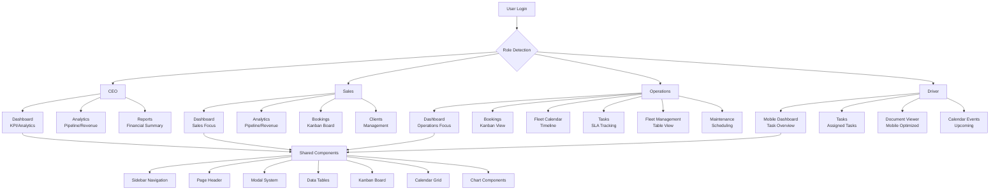
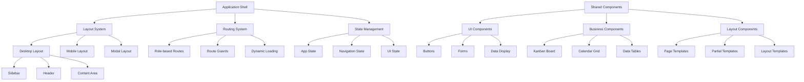
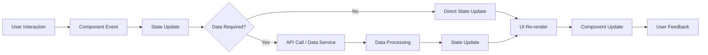
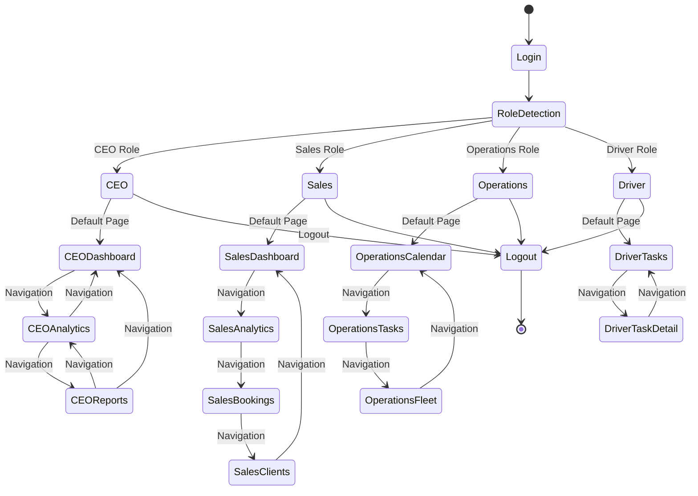

## Architecture Diagrams

### Component Hierarchy



### Data Flow Architecture



### Asset Organization

```mermaid
graph TD
    A[assets/] --> B[css/]
    A --> C[js/]
    A --> D[templates/]

    B --> B1[core/]
    B --> B2[components/]
    B --> B3[pages/]

    B1 --> B1a[reset.css]
    B1 --> B1b[typography.css]
    B1 --> B1c[layout.css]

    B2 --> B2a[sidebar.css]
    B2 --> B2b[header.css]
    B2 --> B2c[modals.css]

    B3 --> B3a[dashboard.css]
    B3 --> B3b[analytics.css]
    B3 --> B3c[reports.css]

    C --> C1[core/]
    C --> C2[components/]
    C --> C3[pages/]

    C1 --> C1a[app.js]
    C1 --> C1b[router.js]
    C1 --> C1c[state.js]

    C2 --> C2a[sidebar.js]
    C2 --> C2b[header.js]
    C2 --> C2c[modals.js]

    C3 --> C3a[dashboard.js]
    C3 --> C3b[analytics.js]
    C3 --> C3c[reports.js]

    D --> D1[layouts/]
    D --> D2[partials/]

    D1 --> D1a[desktop.html]
    D1 --> D1b[mobile.html]
    D1 --> D1c[modal.html]

    D2 --> D2a[components/]
    D2 --> D2b[forms/]
    D2 --> D2c[data/]
```



### Role-Based Navigation Flow



# Modular Architecture Design Document

## Overview

This document outlines the design for transforming the existing monolithic SPA into a modular, role-based architecture that maintains existing functionality while enabling clear separation of concerns and modular development.

## Current State Analysis

### Existing Structure
- **Monolithic HTML**: Single `index.html` with all pages embedded
- **Role-based routing**: Implemented via `ROLES_CONFIG` in `src/data/index.js`
- **Shared components**: Sidebar, header, modals embedded in HTML
- **Asset organization**: Mixed structure with `assets/`, `src/`, `public/`

### Current Roles & Pages
- **CEO**: Dashboard, Reports, Analytics, Bookings, Fleet Calendar
- **Sales**: Fleet Calendar, Bookings, Clients, Analytics
- **Operations**: Fleet Calendar, Tasks, Fleet table
- **Driver**: Mobile view with Tasks and Task details

## Proposed Modular Architecture

### 1. Role-Based Page Mapping

#### CEO Pages
```
Dashboard (KPI, analytics, reports)
├── KPI Cards (revenue, utilization, SLA compliance)
├── Revenue Charts (daily dynamics)
├── Driver Performance Analytics
└── SLA Control Cards

Analytics (sales pipeline, revenue)
├── Sales Pipeline Visualization
├── Revenue by Manager Charts
├── Booking Sources Analytics
└── Lead Details Workspace

Reports (financial summary)
├── Financial Summary Cards
├── Top Vehicles by Profitability
└── Period Selection Controls
```

#### Sales Pages
```
Dashboard (sales-focused)
├── Sales Pipeline Overview
├── Revenue Metrics
├── Lead Conversion Rates
└── Manager Performance

Analytics (sales pipeline, revenue by manager)
├── Pipeline Stages Visualization
├── Manager Revenue Charts
├── Lead Velocity Tracking
└── Conversion Analytics

Bookings (kanban board)
├── Kanban Board with Filters
├── Booking Creation
├── Search and Filtering
└── Status Management

Clients Management
├── Client Table View
├── Client Detail Pages
├── Search and Filtering
└── Client Analytics
```

#### Operations Pages
```
Dashboard (operations-focused)
├── Fleet Utilization KPIs
├── Task SLA Tracking
├── Maintenance Schedules
└── Active Bookings Overview

Bookings (kanban)
├── Kanban Board (read-only for operations)
├── Task Assignment
├── Status Updates
└── SLA Monitoring

Fleet Calendar
├── Calendar Grid View
├── Event Management
├── Maintenance Scheduling
└── Fleet Load Visualization

Tasks (SLA tracking)
├── Task Board (Todo/In Progress/Done)
├── SLA Timers and Alerts
├── Task Assignment
└── Maintenance Logging

Fleet Management
├── Fleet Table View
├── Vehicle Details
├── Maintenance Records
└── Vehicle Creation

Maintenance
├── Maintenance Scheduling
├── Work Order Creation
└── Maintenance History
```

#### Driver Pages
```
Mobile Dashboard
├── Today's Tasks Overview
├── Active Task Tracking
├── Quick Actions
└── Status Updates

Tasks (assigned tasks)
├── Task List with Status
├── Task Details with Checklists
├── Photo/Document Upload
├── SLA Timers
└── GPS Tracking

Document Viewer
├── Document Preview
├── Download Options
└── Navigation Controls

Calendar Events
├── Upcoming Events
├── Event Details
└── Location Information
```

### 2. Shared Components Architecture

#### Core Layout Components
```
Layout System
├── DesktopShell
│   ├── Sidebar (role-specific navigation)
│   ├── Header (page title, actions, filters)
│   └── ContentArea (page content container)
│
├── MobileShell
│   ├── MobileHeader
│   ├── ContentArea
│   └── BottomNavigation (driver-specific)
│
└── Shared Components
    ├── Modal/Dialog System
    ├── Toast Notifications
    ├── Loading States
    └── Error Boundaries
```

#### Reusable UI Components
```
Component Library
├── Data Display
│   ├── DataTable (sortable, filterable)
│   ├── KanbanBoard (drag-drop enabled)
│   ├── CalendarGrid (timeline/calendar views)
│   └── Chart Components (revenue, analytics)
│
├── Forms & Inputs
│   ├── SearchInput
│   ├── FilterDropdowns
│   ├── DateRangePicker
│   └── FileUpload
│
├── Navigation
│   ├── SidebarNav
│   ├── Breadcrumb
│   ├── Pagination
│   └── TabNavigation
│
└── Feedback
    ├── StatusBadges
    ├── ProgressIndicators
    ├── AlertMessages
    └── ConfirmationDialogs
```

### 3. Template System Design

#### Layout Templates
```
Base Templates
├── desktop-layout.html (sidebar + header + content)
├── mobile-layout.html (header + content + nav)
└── modal-layout.html (overlay + content)

Page Templates
├── dashboard-template.html
├── table-view-template.html
├── detail-view-template.html
├── kanban-template.html
└── calendar-template.html
```

#### Partial Templates
```
Reusable Partials
├── components/
│   ├── sidebar-nav.html
│   ├── page-header.html
│   ├── filter-panel.html
│   ├── action-buttons.html
│   └── status-indicators.html
│
├── forms/
│   ├── search-form.html
│   ├── filter-form.html
│   ├── create-form.html
│   └── edit-form.html
│
└── data/
    ├── table-row.html
    ├── kanban-card.html
    ├── calendar-event.html
    └── chart-container.html
```

### 4. Asset Organization Structure

```
assets/
├── css/
│   ├── core/
│   │   ├── reset.css
│   │   ├── typography.css
│   │   └── layout.css
│   ├── components/
│   │   ├── sidebar.css
│   │   ├── header.css
│   │   ├── modals.css
│   │   ├── tables.css
│   │   ├── kanban.css
│   │   └── calendar.css
│   └── pages/
│       ├── dashboard.css
│       ├── analytics.css
│       ├── reports.css
│       ├── bookings.css
│       ├── fleet.css
│       ├── tasks.css
│       └── driver.css
├── js/
│   ├── core/
│   │   ├── app.js (main application logic)
│   │   ├── router.js (enhanced routing)
│   │   ├── state.js (global state management)
│   │   └── utils.js (shared utilities)
│   ├── components/
│   │   ├── sidebar.js
│   │   ├── header.js
│   │   ├── modals.js
│   │   ├── tables.js
│   │   ├── kanban.js
│   │   └── calendar.js
│   └── pages/
│       ├── dashboard.js
│       ├── analytics.js
│       ├── reports.js
│       ├── bookings.js
│       ├── fleet.js
│       ├── tasks.js
│       └── driver.js
└── templates/
    ├── layouts/
    │   ├── desktop.html
    │   ├── mobile.html
    │   └── modal.html
    └── partials/
        ├── components/
        ├── forms/
        └── data/
```

### 5. Data Structure Design

#### Configuration Structure
```
config/
├── roles.json (role definitions and permissions)
├── navigation.json (role-specific nav structures)
├── components.json (component configurations)
└── routing.json (route definitions)
```

#### Mock Data Organization
```
data/
├── mock/
│   ├── users.json
│   ├── roles.json
│   ├── permissions.json
│   └── features.json
├── config/
│   ├── ui-config.json
│   ├── feature-flags.json
│   └── environment.json
└── schemas/
    ├── booking.schema.json
    ├── vehicle.schema.json
    ├── client.schema.json
    └── task.schema.json
```

### 6. Routing Strategy

#### Role-Based Routing Architecture
```
Routing System
├── Base Routes
│   ├── /:role (role-specific landing page)
│   ├── /:role/:page (role-page combinations)
│   └── /:role/:page/:id (detail pages)
│
├── Route Guards
│   ├── Role-based access control
│   ├── Permission validation
│   └── Feature flag checks
│
└── Route Resolution
    ├── Static route mapping
    ├── Dynamic route generation
    └── Fallback handling
```

#### Route Examples
```
/ceo/dashboard → CEO Dashboard
/bookings → Sales Bookings Kanban
/fleet-calendar → Operations Fleet Calendar
/driver/tasks → Driver Mobile Tasks
/ceo/analytics?tab=pipeline → CEO Analytics with Pipeline tab
```

### 7. Component Reusability Patterns

#### Component Inheritance
```
Base Components
├── BaseTable (sorting, filtering, pagination)
├── BaseForm (validation, submission)
├── BaseModal (overlay, close handlers)
└── BaseChart (data binding, responsive)

Role-Specific Extensions
├── SalesTable extends BaseTable (sales-specific columns)
├── OperationsKanban extends BaseKanban (ops-specific workflows)
└── DriverTaskCard extends BaseCard (mobile-optimized)
```

#### Mixin Patterns
```
Mixins
├── Filterable (search, filter logic)
├── Sortable (column sorting)
├── Draggable (drag-drop functionality)
├── Loadable (loading states)
└── Validatable (form validation)
```

#### Shared Business Logic
```
Services
├── DataService (CRUD operations)
├── ValidationService (business rules)
├── NotificationService (toast messages)
└── PermissionService (access control)
```

## Implementation Roadmap

### Phase 1: Foundation
1. Create modular directory structure
2. Extract shared components
3. Implement template system
4. Set up enhanced routing

### Phase 2: Role-Specific Pages
1. CEO pages (Dashboard, Analytics, Reports)
2. Sales pages (Dashboard, Analytics, Bookings, Clients)
3. Operations pages (Dashboard, Bookings, Calendar, Tasks, Fleet)
4. Driver pages (Mobile Dashboard, Tasks, Documents)

### Phase 3: Optimization
1. Component reusability improvements
2. Performance optimizations
3. Testing and validation
4. Documentation updates

## Migration Strategy

### Gradual Migration Approach
1. **Parallel Development**: Build new modular structure alongside existing code
2. **Feature Flags**: Enable new features incrementally
3. **Backward Compatibility**: Maintain existing functionality during transition
4. **Testing**: Comprehensive testing at each migration step

### Risk Mitigation
- **Version Control**: Branch-based development
- **Feature Toggles**: Gradual rollout capabilities
- **Rollback Plan**: Quick reversion to monolithic structure if needed
- **User Testing**: Beta testing with select user groups

## Success Metrics

### Technical Metrics
- **Modularity**: Component reusability > 70%
- **Performance**: Page load time < 2 seconds
- **Maintainability**: Code duplication < 10%
- **Test Coverage**: > 80% for critical paths

### Business Metrics
- **Development Speed**: Feature delivery time reduced by 40%
- **Bug Reduction**: Production bugs decreased by 30%
- **User Satisfaction**: Improved UX scores
- **Scalability**: Easy addition of new roles/features

## Conclusion

This modular architecture design provides a clear path forward for transforming the monolithic SPA into a maintainable, scalable application. The role-based approach ensures that each user type gets an optimized experience while maximizing code reusability and development efficiency.

The design maintains backward compatibility during migration and provides a solid foundation for future enhancements and new feature development.
# Modular Architecture Design Document

## Overview

This document outlines the design for transforming the existing monolithic SPA into a modular, role-based architecture that maintains existing functionality while enabling clear separation of concerns and modular development.

## Current State Analysis

### Existing Structure
- **Monolithic HTML**: Single `index.html` with all pages embedded
- **Role-based routing**: Implemented via `ROLES_CONFIG` in `src/data/index.js`
- **Shared components**: Sidebar, header, modals embedded in HTML
- **Asset organization**: Mixed structure with `assets/`, `src/`, `public/`

### Current Roles & Pages
- **CEO**: Dashboard, Reports, Analytics, Bookings, Fleet Calendar
- **Sales**: Fleet Calendar, Bookings, Clients, Analytics
- **Operations**: Fleet Calendar, Tasks, Fleet table
- **Driver**: Mobile view with Tasks and Task details

## Proposed Modular Architecture

### 1. Role-Based Page Mapping

#### CEO Pages
```
Dashboard (KPI, analytics, reports)
├── KPI Cards (revenue, utilization, SLA compliance)
├── Revenue Charts (daily dynamics)
├── Driver Performance Analytics
└── SLA Control Cards

Analytics (sales pipeline, revenue)
├── Sales Pipeline Visualization
├── Revenue by Manager Charts
├── Booking Sources Analytics
└── Lead Details Workspace

Reports (financial summary)
├── Financial Summary Cards
├── Top Vehicles by Profitability
└── Period Selection Controls
```

#### Sales Pages
```
Dashboard (sales-focused)
├── Sales Pipeline Overview
├── Revenue Metrics
├── Lead Conversion Rates
└── Manager Performance

Analytics (sales pipeline, revenue by manager)
├── Pipeline Stages Visualization
├── Manager Revenue Charts
├── Lead Velocity Tracking
└── Conversion Analytics

Bookings (kanban board)
├── Kanban Board with Filters
├── Booking Creation
├── Search and Filtering
└── Status Management

Clients Management
├── Client Table View
├── Client Detail Pages
├── Search and Filtering
└── Client Analytics
```

#### Operations Pages
```
Dashboard (operations-focused)
├── Fleet Utilization KPIs
├── Task SLA Tracking
├── Maintenance Schedules
└── Active Bookings Overview

Bookings (kanban)
├── Kanban Board (read-only for operations)
├── Task Assignment
├── Status Updates
└── SLA Monitoring

Fleet Calendar
├── Calendar Grid View
├── Event Management
├── Maintenance Scheduling
└── Fleet Load Visualization

Tasks (SLA tracking)
├── Task Board (Todo/In Progress/Done)
├── SLA Timers and Alerts
├── Task Assignment
└── Maintenance Logging

Fleet Management
├── Fleet Table View
├── Vehicle Details
├── Maintenance Records
└── Vehicle Creation

Maintenance
├── Maintenance Scheduling
├── Work Order Creation
└── Maintenance History
```

#### Driver Pages
```
Mobile Dashboard
├── Today's Tasks Overview
├── Active Task Tracking
├── Quick Actions
└── Status Updates

Tasks (assigned tasks)
├── Task List with Status
├── Task Details with Checklists
├── Photo/Document Upload
├── SLA Timers
└── GPS Tracking

Document Viewer
├── Document Preview
├── Download Options
└── Navigation Controls

Calendar Events
├── Upcoming Events
├── Event Details
└── Location Information
```

### 2. Shared Components Architecture

#### Core Layout Components
```
Layout System
├── DesktopShell
│   ├── Sidebar (role-specific navigation)
│   ├── Header (page title, actions, filters)
│   └── ContentArea (page content container)
│
├── MobileShell
│   ├── MobileHeader
│   ├── ContentArea
│   └── BottomNavigation (driver-specific)
│
└── Shared Components
    ├── Modal/Dialog System
    ├── Toast Notifications
    ├── Loading States
    └── Error Boundaries
```

#### Reusable UI Components
```
Component Library
├── Data Display
│   ├── DataTable (sortable, filterable)
│   ├── KanbanBoard (drag-drop enabled)
│   ├── CalendarGrid (timeline/calendar views)
│   └── Chart Components (revenue, analytics)
│
├── Forms & Inputs
│   ├── SearchInput
│   ├── FilterDropdowns
│   ├── DateRangePicker
│   └── FileUpload
│
├── Navigation
│   ├── SidebarNav
│   ├── Breadcrumb
│   ├── Pagination
│   └── TabNavigation
│
└── Feedback
    ├── StatusBadges
    ├── ProgressIndicators
    ├── AlertMessages
    └── ConfirmationDialogs
```

### 3. Template System Design

#### Layout Templates
```
Base Templates
├── desktop-layout.html (sidebar + header + content)
├── mobile-layout.html (header + content + nav)
└── modal-layout.html (overlay + content)

Page Templates
├── dashboard-template.html
├── table-view-template.html
├── detail-view-template.html
├── kanban-template.html
└── calendar-template.html
```

#### Partial Templates
```
Reusable Partials
├── components/
│   ├── sidebar-nav.html
│   ├── page-header.html
│   ├── filter-panel.html
│   ├── action-buttons.html
│   └── status-indicators.html
│
├── forms/
│   ├── search-form.html
│   ├── filter-form.html
│   ├── create-form.html
│   └── edit-form.html
│
└── data/
    ├── table-row.html
    ├── kanban-card.html
    ├── calendar-event.html
    └── chart-container.html
```

### 4. Asset Organization Structure

```
assets/
├── css/
│   ├── core/
│   │   ├── reset.css
│   │   ├── typography.css
│   │   └── layout.css
│   ├── components/
│   │   ├── sidebar.css
│   │   ├── header.css
│   │   ├── modals.css
│   │   ├── tables.css
│   │   ├── kanban.css
│   │   └── calendar.css
│   └── pages/
│       ├── dashboard.css
│       ├── analytics.css
│       ├── reports.css
│       ├── bookings.css
│       ├── fleet.css
│       ├── tasks.css
│       └── driver.css
├── js/
│   ├── core/
│   │   ├── app.js (main application logic)
│   │   ├── router.js (enhanced routing)
│   │   ├── state.js (global state management)
│   │   └── utils.js (shared utilities)
│   ├── components/
│   │   ├── sidebar.js
│   │   ├── header.js
│   │   ├── modals.js
│   │   ├── tables.js
│   │   ├── kanban.js
│   │   └── calendar.js
│   └── pages/
│       ├── dashboard.js
│       ├── analytics.js
│       ├── reports.js
│       ├── bookings.js
│       ├── fleet.js
│       ├── tasks.js
│       └── driver.js
└── templates/
    ├── layouts/
    │   ├── desktop.html
    │   ├── mobile.html
    │   └── modal.html
    └── partials/
        ├── components/
        ├── forms/
        └── data/
```

### 5. Data Structure Design

#### Configuration Structure
```
config/
├── roles.json (role definitions and permissions)
├── navigation.json (role-specific nav structures)
├── components.json (component configurations)
└── routing.json (route definitions)
```

#### Mock Data Organization
```
data/
├── mock/
│   ├── users.json
│   ├── roles.json
│   ├── permissions.json
│   └── features.json
├── config/
│   ├── ui-config.json
│   ├── feature-flags.json
│   └── environment.json
└── schemas/
    ├── booking.schema.json
    ├── vehicle.schema.json
    ├── client.schema.json
    └── task.schema.json
```

### 6. Routing Strategy

#### Role-Based Routing Architecture
```
Routing System
├── Base Routes
│   ├── /:role (role-specific landing page)
│   ├── /:role/:page (role-page combinations)
│   └── /:role/:page/:id (detail pages)
│
├── Route Guards
│   ├── Role-based access control
│   ├── Permission validation
│   └── Feature flag checks
│
└── Route Resolution
    ├── Static route mapping
    ├── Dynamic route generation
    └── Fallback handling
```

#### Route Examples
```
/ceo/dashboard → CEO Dashboard
/bookings → Sales Bookings Kanban
/fleet-calendar → Operations Fleet Calendar
/driver/tasks → Driver Mobile Tasks
/ceo/analytics?tab=pipeline → CEO Analytics with Pipeline tab
```

### 7. Component Reusability Patterns

#### Component Inheritance
```
Base Components
├── BaseTable (sorting, filtering, pagination)
├── BaseForm (validation, submission)
├── BaseModal (overlay, close handlers)
└── BaseChart (data binding, responsive)

Role-Specific Extensions
├── SalesTable extends BaseTable (sales-specific columns)
├── OperationsKanban extends BaseKanban (ops-specific workflows)
└── DriverTaskCard extends BaseCard (mobile-optimized)
```

#### Mixin Patterns
```
Mixins
├── Filterable (search, filter logic)
├── Sortable (column sorting)
├── Draggable (drag-drop functionality)
├── Loadable (loading states)
└── Validatable (form validation)
```

#### Shared Business Logic
```
Services
├── DataService (CRUD operations)
├── ValidationService (business rules)
├── NotificationService (toast messages)
└── PermissionService (access control)
```

## Implementation Roadmap

### Phase 1: Foundation
1. Create modular directory structure
2. Extract shared components
3. Implement template system
4. Set up enhanced routing

### Phase 2: Role-Specific Pages
1. CEO pages (Dashboard, Analytics, Reports)
2. Sales pages (Dashboard, Analytics, Bookings, Clients)
3. Operations pages (Dashboard, Bookings, Calendar, Tasks, Fleet)
4. Driver pages (Mobile Dashboard, Tasks, Documents)

### Phase 3: Optimization
1. Component reusability improvements
2. Performance optimizations
3. Testing and validation
4. Documentation updates

## Migration Strategy

### Gradual Migration Approach
1. **Parallel Development**: Build new modular structure alongside existing code
2. **Feature Flags**: Enable new features incrementally
3. **Backward Compatibility**: Maintain existing functionality during transition
4. **Testing**: Comprehensive testing at each migration step

### Risk Mitigation
- **Version Control**: Branch-based development
- **Feature Toggles**: Gradual rollout capabilities
- **Rollback Plan**: Quick reversion to monolithic structure if needed
- **User Testing**: Beta testing with select user groups

## Success Metrics

### Technical Metrics
- **Modularity**: Component reusability > 70%
- **Performance**: Page load time < 2 seconds
- **Maintainability**: Code duplication < 10%
- **Test Coverage**: > 80% for critical paths

### Business Metrics
- **Development Speed**: Feature delivery time reduced by 40%
- **Bug Reduction**: Production bugs decreased by 30%
- **User Satisfaction**: Improved UX scores
- **Scalability**: Easy addition of new roles/features

## Conclusion

This modular architecture design provides a clear path forward for transforming the monolithic SPA into a maintainable, scalable application. The role-based approach ensures that each user type gets an optimized experience while maximizing code reusability and development efficiency.

The design maintains backward compatibility during migration and provides a solid foundation for future enhancements and new feature development.
