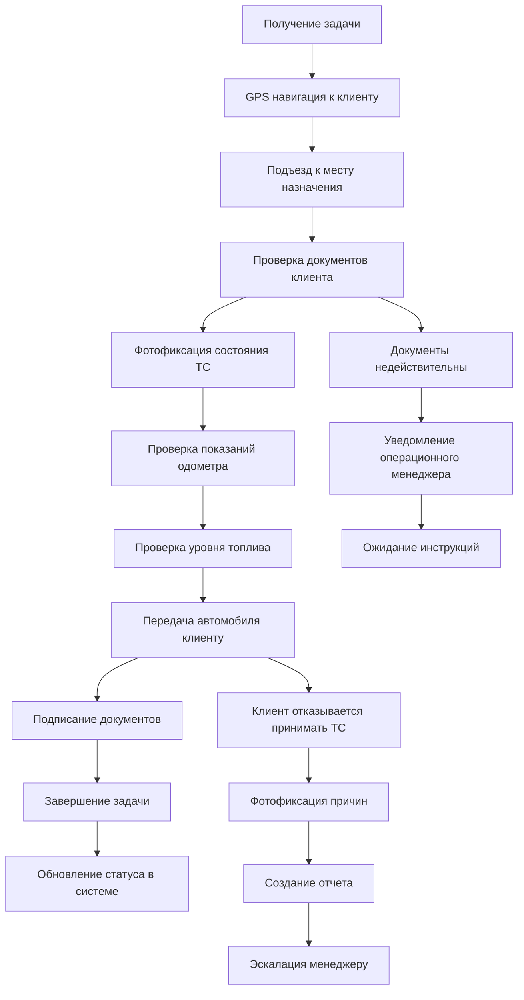
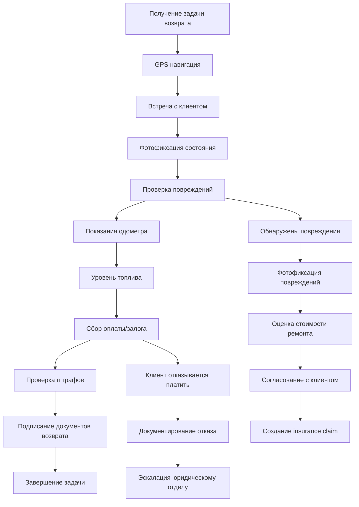
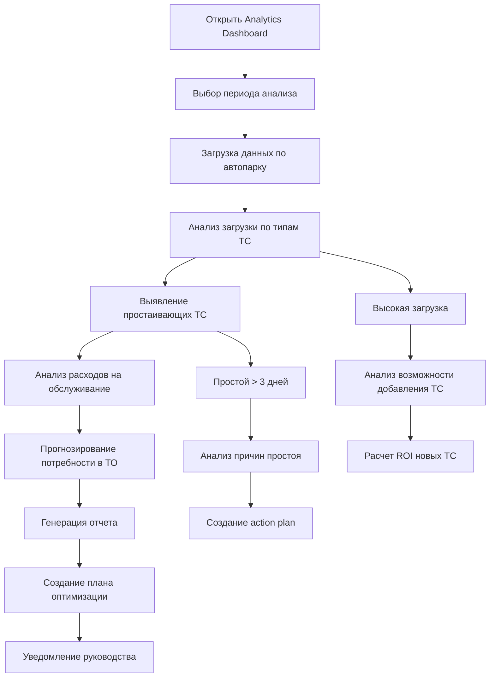

# Product Requirements Document (PRD)
# SkyLuxse - Система управления премиальным сервисом аренды автомобилей

**Версия:** 1.0  
**Дата:** 05.11.2025  
**Статус:** Draft  
**Автор:** Продуктовая команда SkyLuxse  

---

## Оглавление

1. [Executive Summary](#1-executive-summary)
2. [Product Scope, Features & Modules](#2-product-scope-features--modules)
3. [Module Specifications](#3-module-specifications)
4. [Sitemap & Interaction Flows](#4-sitemap--interaction-flows)
5. [User Experience & Design Requirements](#5-user-experience--design-requirements)
6. [Technical Specifications](#6-technical-specifications)
7. [Delivery & Operations](#7-delivery--operations)
8. [Appendices](#8-appendices)

---

## 1. Executive Summary

### 1.1 Видение продукта

**SkyLuxse** - это революционная система управления премиальным сервисом аренды автомобилей класса люкс в Дубае, объединяющая передовые технологии искусственного интеллекта, облачную архитектуру и автоматизацию бизнес-процессов для создания бесшовного клиентского опыта.

Система представляет собой комплексное решение "полного цикла", от первичного обращения клиента до возврата автомобиля, с интеграцией GPS-трекинга, автоматизированного биллинга, управления отношениями с клиентами и аналитики в реальном времени.

### 1.2 Цели продукта

#### Стратегические цели:
- **Автоматизация 80% ручных операций** в процессе управления арендой
- **Сокращение времени обработки бронирований на 60%** за счет ИИ-ассистентов
- **Увеличение клиентской удовлетворенности на 45%** через персонализированный сервис
- **Рост выручки на 35%** за счет оптимизации загрузки автопарка

#### Операционные цели:
- Создание единого центра управления всеми операциями
- Обеспечение прозрачности процессов для всех участников
- Повышение эффективности использования автопарка до 90%
- Сокращение операционных затрат на 25%

### 1.3 Целевая аудитория

#### Первичные пользователи (B2B)

| Роль | Количество | Основные задачи | Ключевые KPI |
|------|------------|-----------------|--------------|
| **Operations Manager** | 2-3 чел. | Общий контроль процессов, принятие решений | Время обработки заявок, качество обслуживания |
| **Fleet Manager** | 1-2 чел. | Управление автопарком, обслуживание | Загрузка автопарка, downtime, затраты на ТО |
| **Sales Manager** | 3-5 чел. | Продажи, работа с клиентами, конверсия | Конверсия лидов, средний чек, LTV клиентов |
| **Driver** | 15-25 чел. | Выполнение операционных задач, клиентский сервис | Время выполнения задач, рейтинг обслуживания |
| **CEO** | 1 чел. | Стратегическое управление, аналитика | ROI, доля рынка, рост выручки |

#### Вторичные пользователи (B2C/B2B)

| Тип пользователя | Роль | Доступ к системе |
|------------------|------|-------------------|
| **VIP Клиенты** | Премиальные клиенты | Персональный портал, приоритетное обслуживание |
| **Корпоративные клиенты** | B2B партнеры | API интеграция, bulk операции |
| **Техподдержка** | Администраторы | Полный административный доступ |

### 1.4 Ценностные предложения

#### Для бизнеса (B2B):
- **Увеличение доходности автопарка** на 40% за счет оптимизации загрузки
- **Сокращение операционных расходов на 30%** через автоматизацию
- **Повышение качества обслуживания** благодаря ИИ-мониторингу процессов
- **Конкурентное преимущество** через предиктивную аналитику

#### Для клиентов (B2C):
- **Бесшовный опыт бронирования** с моментальным подтверждением
- **Прозрачность ценообразования** без скрытых платежей
- **Премиальный сервис 24/7** с персональным менеджером
- **Гибкость управления бронированием** через мобильное приложение

#### Для водителей:
- **Интеллектуальная навигация** с оптимизацией маршрутов
- **Автоматизация документооборота** через мобильный интерфейс
- **Прозрачная система оценки** с бонусами за качество обслуживания

### 1.5 Ключевые метрики успеха (KPI)

#### Операционные метрики:
| Метрика | Текущее значение | Целевое значение | Период измерения |
|---------|------------------|------------------|------------------|
| **Время обработки бронирования** | 45 мин | 15 мин | Еженедельно |
| **Загрузка автопарка** | 65% | 90% | Ежемесячно |
| **Клиентская удовлетворенность (NPS)** | 72 | 90 | Ежеквартально |
| **Время простоя автопарка** | 25% | 10% | Еженедельно |

#### Финансовые метрики:
| Метрика | Текущее значение | Целевое значение | Период измерения |
|---------|------------------|------------------|------------------|
| **Средний чек** | $850 | $1,100 | Ежемесячно |
| **LTV клиента** | $2,400 | $4,200 | Ежегодно |
| **Конверсия лидов** | 18% | 35% | Ежемесячно |
| **Операционная маржа** | 32% | 48% | Ежеквартально |

#### Технические метрики:
| Метрика | Текущее значение | Целевое значение | Период измерения |
|---------|------------------|------------------|------------------|
| **Uptime системы** | 99.2% | 99.9% | Ежемесячно |
| **Время отклика API** | 850 мс | 200 мс | Ежедневно |
| **Mobile adoption** | 45% | 75% | Ежеквартально |
| **Автоматизация процессов** | 35% | 80% | Ежемесячно |

---

## 2. Product Scope, Features & Modules

### 2.1 Область продукта (Product Scope)

#### In Scope (В рамках проекта):

**Core Modules:**
- Fleet Management System (Управление автопарком)
- Booking System (Система бронирований)
- Client Management (Управление клиентами)
- Task Management (Система задач)
- Driver Management (Управление водителями)
- Analytics & Reporting (Аналитика и отчеты)

**Supporting Systems:**
- AI/ML Engine для автоматизации и аналитики
- Payment Gateway Integration (Stripe, PayPal)
- CRM Integration (Salesforce, HubSpot)
- GPS Tracking System
- Document Management System
- Notification & Communication System

#### Out of Scope (Вне рамок проекта):
- Нативные мобильные приложения (планируется на Фаза 2)
- White-label решение для перепродажи
- Интеграция с Uber/Lyft API
- Blockchain-решения для документооборота
- IoT интеграция с автономными автомобилями

### 2.2 Детальная таблица функций с приоритетами

| Модуль | Функция | Приоритет | Сложность | Релиз | Описание |
|--------|---------|-----------|-----------|-------|----------|
| **Fleet Management** | Реестр автомобилей с фотографиями | P1 | M | MVP | Полная информация о каждом ТС с визуальной документацией |
| | Мониторинг статусов в реальном времени | P1 | M | MVP | Статусы: Доступен/В аренде/Обслуживание/Резерв |
| | Управление документами (страховка, регистрация) | P1 | H | MVP | Автоматическое отслеживание сроков действия документов |
| | AI-прогнозирование обслуживания | P2 | H | V1.2 | Предиктивная аналитика для планирования ТО |
| | Календарь автопарка с конфликтами | P1 | M | MVP | Визуализация занятости и планирование обслуживания |
| **Booking System** | Создание бронирований с автопоиском | P1 | H | MVP | Умный поиск доступных автомобилей по критериям |
| | Kanban доска управления статусами | P1 | M | MVP | Визуальное управление воронкой бронирований |
| | Система расширения аренды | P2 | M | V1.1 | Автоматический расчет и оформление продления |
| | AI-ассистент для динамического ценообразования | P3 | H | V2.0 | ИИ-алгоритмы для оптимизации ценообразования |
| | Интеграция с платежными системами | P1 | H | MVP | Stripe, PayPal, банковские переводы |
| **Client Management** | Профили клиентов с историей взаимодействий | P1 | M | MVP | Полная CRM система с персональной информацией |
| | Система сегментации (VIP/Gold/Silver) | P1 | L | MVP | Автоматическая категоризация клиентов |
| | Анализ пожизненной ценности клиента (LTV) | P2 | M | V1.1 | Прогнозирование ценности клиента для бизнеса |
| | AI-персонализация предложений | P3 | H | V2.0 | Машинное обучение для персональных рекомендаций |
| | Проверка кредитоспособности | P2 | M | V1.1 | Интеграция с кредитными бюро ОАЭ |
| **Task Management** | Автоматическое создание задач | P1 | M | MVP | Генерация задач на основе событий в системе |
| | GPS навигация для водителей | P1 | H | MVP | Интеграция с Google Maps для оптимизации маршрутов |
| | Чек-листы для стандартизации процессов | P1 | L | MVP | Обязательные процедуры для каждого типа задач |
| | SLA мониторинг и эскалация | P2 | M | V1.1 | Автоматическое отслеживание сроков и эскалация |
| | AI-оптимизация распределения задач | P3 | H | V2.0 | Умное назначение задач на основе навыков и локации |
| **Driver Management** | GPS трекинг в реальном времени | P1 | H | MVP | Мониторинг местоположения и статуса водителей |
| | Мобильный интерфейс для водителей | P1 | M | MVP | Адаптированный интерфейс для операционных задач |
| | Система оценки производительности | P2 | M | V1.1 | KPI водителей и система поощрений |
| | Push-уведомления о новых задачах | P1 | L | MVP | Мгновенные уведомления о назначенных задачах |
| | Сбор платежей через мобильное приложение | P2 | M | V1.1 | Интеграция с платежными системами для водителей |
| **Analytics & Reporting** | Дашборды с ключевыми метриками | P1 | H | MVP | Real-time аналитика для всех ролей пользователей |
| | Финансовая отчетность и прогнозирование | P1 | M | MVP | Детальная финансовая аналитика с прогнозами |
| | AI-powered отчеты о поведении клиентов | P2 | H | V1.2 | Машинное обучение для анализа паттернов |
| | Predictive maintenance для автопарка | P3 | H | V2.0 | Прогнозирование потребности в обслуживании |
| | Экспорт данных в BI системы | P2 | M | V1.1 | Интеграция с Tableau, Power BI для углубленной аналитики |

### 2.3 Персоны пользователей

#### Persona 1: Operations Manager - "Александр Волков"
**Демография:** Мужчина, 35 лет, 8 лет в автомобильной индустрии  
**Цели:** Эффективное управление операциями, минимизация простоев, максимизация прибыли  
**Болевые точки:** Отсутствие real-time данных, ручная координация между отделами, сложности с планированием ресурсов  
**Технические навыки:** Средние (опыт работы с корпоративными системами)  
**Использование системы:** 8-10 часов в день, множественные задачи, потребность в быстром доступе к критической информации  
**Ключевые потребности:** Дашборд с ключевыми метриками, уведомления об критических событиях, возможности drill-down в детали  

#### Persona 2: Fleet Manager - "Елена Смирнова"
**Демография:** Женщина, 32 года, 6 лет в управлении автопарком  
**Цели:** Поддержание высокого качества автопарка, минимизация затрат на обслуживание, соблюдение compliance  
**Болевые точки:** Непредсказуемые поломки, сложности с планированием ТО, контроль документооборота  
**Технические навыки:** Высокие (опыт работы с специализированным ПО для автопарка)  
**Использование системы:** 7-8 часов в день, фокус на автопарк, работа с документами  
**Ключевые потребности:** Детальная информация о каждом ТС, календарь обслуживания, автоматические уведомления о документах  

#### Persona 3: Sales Manager - "Михаил Козлов"
**Демография:** Мужчина, 28 лет, 4 года в B2B продажах премиум-сегмента  
**Цели:** Максимизация продаж, работа с VIP клиентами, развитие долгосрочных отношений  
**Болевые точки:** Сложности с отслеживанием воронки продаж, неэффективная работа с лидами, отсутствие CRM интеграции  
**Технические навыки:** Средние (активное использование CRM и email маркетинга)  
**Использование системы:** 6-7 часов в день, работа с клиентами, аналитика продаж  
**Ключевые потребности:** Профили клиентов с историей, аналитика конверсии, инструменты для follow-up  

#### Persona 4: Driver - "Ахмед Аль-Мансури"
**Демография:** Мужчина, 29 лет, 3 года водитель, местный житель Дубая  
**Цели:** Эффективное выполнение задач, высокие чаевые, хорошие отзывы клиентов  
**Болевые точки:** Сложная навигация, ручное документирование, задержки с оплатой  
**Технические навыки:** Базовые (уверенное использование смартфона)  
**Использование системы:** 4-6 часов в день, в основном мобильное использование  
**Ключевые потребности:** Простая навигация, быстрое выполнение чек-листов, мгновенное получение оплаты  

#### Persona 5: CEO - "Принц Халед Аль-Мактум"
**Демография:** Мужчина, 42 года, владелец бизнеса, MBA, 15+ лет в автомобильной индустрии  
**Цели:** Рост бизнеса, увеличение прибыльности, стратегическое развитие  
**Болевые точки:** Отсутствие реальной-time аналитики, сложности с принятием data-driven решений  
**Технические навыки:** Базовые (предпочитает получать информацию в агрегированном виде)  
**Использование системы:** 1-2 часа в день, фокус на стратегических метриках  
**Ключевые потребности:** Executive дашборд с KPI, автоматические отчеты, прогнозы и рекомендации  

### 2.4 Границы системы (System Boundaries)

#### Что система включает:
1. **Полный цикл управления арендой** - от бронирования до возврата
2. **Интеграция с внешними системами** - платежи, карты, CRM, ERP
3. **AI/ML функциональность** - автоматизация и аналитика
4. **Мультиплатформенный доступ** - веб-интерфейс для персонала, мобильное приложение для водителей
5. **Compliance и безопасность** - GDPR, UAE Data Protection, аудит

#### Что система исключает:
1. **Интеграция с конкурентами** - Uber, Careem, другие сервисы аренды
2. **Физическое обслуживание автомобилей** - ремонтные работы, шиномонтаж
3. **Страховые продукты** - продажа страховок клиентам
4. **Лизинговые услуги** - долгосрочная аренда, lease-to-own
5. **Международная экспансия** - за пределы ОАЭ

---

## 3. Module Specifications

### 3.1 Fleet Management System

#### 3.1.1 Обзор модуля
Модуль управления автопарком обеспечивает полный контроль над транспортными средствами, включая мониторинг статусов, планирование обслуживания, управление документами и аналитику производительности.

#### 3.1.2 Ключевые функции

**3.1.2.1 Реестр автомобилей**
- **Описание:** Централизованная база данных всех транспортных средств
- **Функциональность:**
  - Добавление/редактирование информации о ТС
  - Загрузка и управление фотографиями
  - История изменений для каждого ТС
  - Поиск и фильтрация по множественным критериям
- **Приоритет:** P1
- **Сложность:** M
- **Зависимости:** Document Management, Analytics

**3.1.2.2 Мониторинг статусов**
- **Описание:** Real-time отслеживание состояния каждого автомобиля
- **Статусы:**
  - `available` - Доступен для аренды
  - `booked` - Забронирован
  - `in_rental` - В аренде
  - `maintenance` - На обслуживании
  - `repair` - В ремонте
  - `pending_return` - Ожидает возврата
- **Функциональность:**
  - Автоматическое обновление статусов
  - Визуальная индикация в интерфейсе
  - Интеграция с GPS трекингом
- **Приоритет:** P1
- **Сложность:** M
- **Зависимости:** Task Management, GPS Tracking

**3.1.2.3 Управление документами**
- **Описание:** Система контроля документов и их сроков действия
- **Типы документов:**
  - Vehicle Registration (Mulkiya)
  - Insurance Policy
  - Annual Inspection Certificate
  - Commercial License
- **Функциональность:**
  - Автоматические уведомления об истечении сроков
  - Статусы проверки документов
  - Хранение цифровых копий
  - Compliance отчетность
- **Приоритет:** P1
- **Сложность:** H
- **Зависимости:** Notification System, Compliance Module

**3.1.2.4 Календарь автопарка**
- **Описание:** Визуальное планирование занятости и обслуживания ТС
- **Функциональность:**
  - Timeline представление для каждого ТС
  - Автоматическое обнаружение конфликтов
  - Интеграция с системой бронирований
  - Планирование профилактического обслуживания
- **Приоритет:** P1
- **Сложность:** M
- **Зависимости:** Booking System, Task Management

**3.1.2.5 AI-прогнозирование обслуживания**
- **Описание:** Машинное обучение для предсказания потребности в обслуживании
- **Функциональность:**
  - Анализ паттернов использования ТС
  - Предиктивное моделирование поломок
  - Оптимизация расписания ТО
  - Прогнозирование затрат на обслуживание
- **Приоритет:** P2
- **Сложность:** H
- **Зависимости:** ML Engine, Analytics

#### 3.1.3 Технические спецификации

**Сущность данных:**
```typescript
interface Vehicle {
  id: string;
  make: string;           // Производитель
  model: string;          // Модель
  year: number;           // Год выпуска
  plateNumber: string;    // Госномер
  vin: string;           // VIN номер
  class: VehicleClass;    // Класс (luxury, sports, suv, etc.)
  segment: VehicleSegment; // Сегмент (premium, ultra-luxury, hyper-luxury)
  color: string;         // Цвет
  mileage: number;       // Пробег
  status: VehicleStatus; // Статус ТС
  location: GeoLocation; // Текущая локация
  documents: VehicleDocument[]; // Документы
  images: VehicleImage[]; // Фотографии
  specifications: VehicleSpecs; // Технические характеристики
  rentalHistory: RentalRecord[]; // История аренд
  maintenanceHistory: MaintenanceRecord[]; // История обслуживания
  aiMetrics: AIMetrics;  // AI-показатели
  createdAt: Date;
  updatedAt: Date;
}
```

**API endpoints:**
```
GET    /api/vehicles              # Получить список ТС
POST   /api/vehicles              # Создать новое ТС
GET    /api/vehicles/{id}         # Получить детали ТС
PUT    /api/vehicles/{id}         # Обновить ТС
DELETE /api/vehicles/{id}         # Удалить ТС
GET    /api/vehicles/{id}/calendar # Получить календарь ТС
GET    /api/vehicles/available    # Получить доступные ТС
POST   /api/vehicles/{id}/status  # Обновить статус ТС
GET    /api/vehicles/{id}/maintenance # История обслуживания
```

#### 3.1.4 Пользовательские истории

**Как Fleet Manager, я хочу:**
- Быстро найти информацию о любом ТС в системе, чтобы принимать оперативные решения
- Получать уведомления о документе с истекающим сроком, чтобы избежать штрафов
- Планировать обслуживание в удобное время, чтобы минимизировать простой
- Видеть прогноз затрат на обслуживание, чтобы планировать бюджет
- Анализировать производительность каждого ТС, чтобы оптимизировать автопарк

### 3.2 Booking System

#### 3.2.1 Обзор модуля
Система бронирований является ядром бизнес-процессов, обеспечивая создание, управление и отслеживание всех бронирований с интеграцией AI для оптимизации процессов.

#### 3.2.2 Ключевые функции

**3.2.2.1 Создание бронирований с автопоиском**
- **Описание:** Интеллектуальный поиск доступных автомобилей
- **Функциональность:**
  - AI-powered поиск по критериям клиента
  - Автоматический подбор оптимального ТС
  - Real-time проверка доступности
  - Динамическое ценообразование
- **Приоритет:** P1
- **Сложность:** H
- **Зависимости:** Fleet Management, Pricing Engine, Client Management

**3.2.2.2 Kanban доска управления**
- **Описание:** Визуальное управление статусами бронирований
- **Статусы:**
  - `lead` - Первичное обращение
  - `contacted` - Связались с клиентом
  - `confirmed` - Подтверждено
  - `pickup_scheduled` - Запланирован pickup
  - `in_progress` - В процессе аренды
  - `completed` - Завершено
  - `cancelled` - Отменено
- **Функциональность:**
  - Drag & drop изменение статусов
  - Автоматические уведомления при смене статуса
  - Фильтрация по менеджерам, датам, клиентам
- **Приоритет:** P1
- **Сложность:** M
- **Зависимости:** Notification System, Client Management

**3.2.2.3 Система расширения аренды**
- **Описание:** Автоматическое оформление продления бронирования
- **Функциональность:**
  - Расчет дополнительной стоимости
  - Проверка доступности автомобиля
  - Автоматическое создание invoice
  - Интеграция с payment gateway
- **Приоритет:** P2
- **Сложность:** M
- **Зависимости:** Fleet Management, Payment Gateway

**3.2.2.4 AI-ассистент ценообразования**
- **Описание:** Динамическое ценообразование на основе множественных факторов
- **Факторы:**
  - Сезонность и праздники
  - Спрос на конкретный класс ТС
  - Срок аренды
  - История клиента
  - Специальные события в Дубае
- **Приоритет:** P3
- **Сложность:** H
- **Зависимости:** ML Engine, Analytics, External Events API

#### 3.2.3 Технические спецификации

**Сущность данных:**
```typescript
interface Booking {
  id: string;
  bookingCode: string;     // Уникальный код бронирования
  clientId: string;        // ID клиента
  vehicleId: string;       // ID автомобиля
  driverId?: string;       // ID водителя (опционально)
  startDate: Date;         // Дата начала аренды
  endDate: Date;           // Дата окончания аренды
  startTime: Time;         // Время начала
  endTime: Time;           // Время окончания
  pickupLocation: Location; // Место получения
  dropoffLocation: Location; // Место возврата
  status: BookingStatus;   // Статус бронирования
  pricing: PricingDetails; // Детали ценообразования
  extensions: BookingExtension[]; // Расширения
  tasks: Task[];           // Связанные задачи
  history: BookingHistory[]; // История изменений
  aiRecommendations: AIRecommendations; // AI рекомендации
  paymentStatus: PaymentStatus; // Статус оплаты
  createdAt: Date;
  updatedAt: Date;
}
```

#### 3.2.4 Пользовательские истории

**Как Sales Manager, я хочу:**
- Быстро создавать бронирование с автоматическим поиском подходящего ТС, чтобы экономить время
- Видеть полную историю взаимодействий с клиентом, чтобы обеспечить персонализированный сервис
- Получать уведомления о статусе платежа, чтобы своевременно реагировать на проблемы
- Анализировать воронку продаж, чтобы оптимизировать процесс продаж
- Легко продлевать бронирование, чтобы увеличить средний чек

### 3.3 Client Management

#### 3.3.1 Обзор модуля
Система управления клиентами обеспечивает полный CRM функционал для работы с клиентской базой, включая анализ поведения, сегментацию и персонализацию предложений.

#### 3.3.2 Ключевые функции

**3.3.2.1 Профили клиентов**
- **Описание:** Детальная информация о каждом клиенте
- **Функциональность:**
  - Персональная информация и контакты
  - История всех бронирований и платежей
  - Предпочтения и особенности обслуживания
  - Документы и их статусы проверки
  - Система оценок и отзывов
- **Приоритет:** P1
- **Сложность:** M
- **Зависимости:** Booking System, Document Management

**3.3.2.2 Система сегментации**
- **Описание:** Автоматическая категоризация клиентов
- **Сегменты:**
  - `VIP` - Premium клиенты с LTV > $10,000
  - `Gold` - Постоянные клиенты с LTV > $5,000
  - `Silver` - Регулярные клиенты
  - `Bronze` - Новые клиенты
- **Функциональность:**
  - Автоматическая классификация
  - Персонализированные предложения
  - Специальные привилегии для VIP
- **Приоритет:** P1
- **Сложность:** L
- **Зависимости:** Analytics Engine

**3.3.2.3 LTV анализ**
- **Описание:** Прогнозирование пожизненной ценности клиента
- **Функциональность:**
  - Исторический анализ расходов
  - Прогнозирование будущих доходов
  - Рекомендации по удержанию клиентов
  - ROI расчет на маркетинг
- **Приоритет:** P2
- **Сложность:** M
- **Зависимости:** ML Engine, Payment History

**3.3.2.4 AI-персонализация**
- **Описание:** Машинное обучение для персональных предложений
- **Функциональность:**
  - Анализ предпочтений клиента
  - Рекомендации автомобилей
  - Оптимальное время контакта
  - Прогноз вероятности повторной аренды
- **Приоритет:** P3
- **Сложность:** H
- **Зависимости:** ML Engine, Behavioral Analytics

### 3.4 Task Management

#### 3.4.1 Обзор модуля
Система управления задачами обеспечивает автоматизацию операционных процессов, назначение ответственных и контроль выполнения SLA.

#### 3.4.2 Ключевые функции

**3.4.2.1 Автоматическое создание задач**
- **Описание:** Генерация задач на основе событий в системе
- **Триггеры:**
  - Создание бронирования
  - Изменение статуса бронирования
  - Приближение срока обслуживания ТС
  - Истечение документов
- **Функциональность:**
  - Автоматическое назначение ответственных
  - Генерация чек-листов
  - Установка приоритетов и сроков
- **Приоритет:** P1
- **Сложность:** M
- **Зависимости:** Booking System, Fleet Management, Driver Management

**3.4.2.2 GPS навигация**
- **Описание:** Интеграция с картами для оптимизации маршрутов
- **Функциональность:**
  - Расчет оптимальных маршрутов
  - Real-time трафик анализ
  - Альтернативные маршруты
  - Время в пути и прибытия
- **Приоритет:** P1
- **Сложность:** H
- **Зависимости:** Google Maps API, Driver Management

**3.4.2.3 Чек-листы**
- **Описание:** Стандартизированные процедуры для операций
- **Типы чек-листов:**
  - Подготовка автомобиля к аренде
  - Процедура передачи клиенту
  - Процедура возврата
  - Обслуживание и ремонт
- **Функциональность:**
  - Обязательные и опциональные пункты
  - Фотофиксация состояния
  - Подписи и подтверждения
- **Приоритет:** P1
- **Сложность:** L
- **Зависимости:** Document Management, Photo Storage

**3.4.2.4 SLA мониторинг**
- **Описание:** Контроль сроков выполнения задач
- **Функциональность:**
  - Real-time отслеживание прогресса
  - Автоматические эскалации при задержках
  - Уведомления ответственным и руководителям
  - Отчетность по соблюдению SLA
- **Приоритет:** P2
- **Сложность:** M
- **Зависимости:** Notification System, Analytics

### 3.5 Driver Management

#### 3.5.1 Обзор модуля
Система управления водителями обеспечивает координацию операционных задач, GPS трекинг и мобильный интерфейс для эффективной работы.

#### 3.5.2 Ключевые функции

**3.5.2.1 GPS трекинг**
- **Описание:** Real-time мониторинг местоположения водителей
- **Функциональность:**
  - Обновление координат каждые 30 секунд
  - История перемещений
  - Геофенсинг и уведомления
  - Интеграция с системой задач
- **Приоритет:** P1
- **Сложность:** H
- **Зависимости:** Task Management, Mobile App

**3.5.2.2 Мобильный интерфейс**
- **Описание:** Адаптированный интерфейс для водителей
- **Функциональность:**
  - Список активных задач
  - Навигация к локациям
  - Выполнение чек-листов
  - Фотофиксация и подписи
  - Сбор платежей
- **Приоритет:** P1
- **Сложность:** M
- **Зависимости:** Task Management, Photo Storage, Payment Gateway

**3.5.2.3 Система оценки**
- **Описание:** KPI и система поощрений для водителей
- **Метрики:**
  - Время выполнения задач
  - Количество обработанных заказов
  - Оценки от клиентов
  - Процент соблюдения SLA
- **Приоритет:** P2
- **Сложность:** M
- **Зависимости:** Client Feedback, Task Analytics

### 3.6 Analytics & Reporting

#### 3.6.1 Обзор модуля
Аналитический модуль предоставляет comprehensive insights в реальном времени, предиктивную аналитику и автоматизированную отчетность для всех уровней управления.

#### 3.6.2 Ключевые функции

**3.6.2.1 Executive Dashboard**
- **Описание:** Стратегические метрики для топ-менеджмента
- **Метрики:**
  - Финансовые показатели (выручка, прибыль, маржа)
  - Операционные метрики (загрузка автопарка, клиентская удовлетворенность)
  - Стратегические KPI (NPS, рыночная доля, рост)
- **Функциональность:**
  - Real-time обновление данных
  - Сравнение с целевыми показателями
  - Прогнозирование трендов
- **Приоритет:** P1
- **Сложность:** H
- **Зависимости:** All Core Modules, Data Warehouse

**3.6.2.2 Financial Analytics**
- **Описание:** Детальная финансовая аналитика и прогнозирование
- **Функциональность:**
  - Анализ доходов по сегментам клиентов
  - Рентабельность по типам автомобилей
  - Прогнозирование cash flow
  - Анализ ценообразования
- **Приоритет:** P1
- **Сложность:** M
- **Зависимости:** Booking System, Client Management

**3.6.2.3 Operational Analytics**
- **Описание:** Анализ операционной эффективности
- **Функциональность:**
  - Анализ загрузки автопарка
  - Производительность водителей
  - Анализ операционных расходов
  - Эффективность процессов
- **Приоритет:** P1
- **Сложность:** M
- **Зависимости:** Fleet Management, Driver Management, Task Management

**3.6.2.4 Predictive Analytics**
- **Описание:** AI-powered прогнозирование и рекомендации
- **Функциональность:**
  - Прогнозирование спроса на автомобили
  - Анализ рисков клиентов
  - Предсказание поломок
  - Оптимизация ценообразования
- **Приоритет:** P2
- **Сложность:** H
- **Зависимости:** ML Engine, All Data Sources

**3.6.2.5 Client Analytics**
- **Описание:** Глубокий анализ поведения клиентов
- **Функциональность:**
  - Сегментация клиентов
  - Анализ lifetime value
  - Прогнозирование оттока
  - Рекомендации по удержанию
- **Приоритет:** P2
- **Сложность:** M
- **Зависимости:** Client Management, ML Engine

---

## 4. Sitemap & Interaction Flows

### 4.1 Архитектура приложения (Next.js/React)

#### 4.1.1 Общая структура

```
SkyLuxse Application
├── Core Application (Next.js 14+)
│   ├── Pages/
│   │   ├── Dashboard/
│   │   │   ├── index.tsx (Executive Dashboard)
│   │   │   ├── operations.tsx (Operations Manager)
│   │   │   ├── fleet.tsx (Fleet Manager)
│   │   │   ├── sales.tsx (Sales Manager)
│   │   │   └── analytics.tsx (Analytics Dashboard)
│   │   ├── Fleet/
│   │   │   ├── index.tsx (Fleet Overview)
│   │   │   ├── [id].tsx (Vehicle Details)
│   │   │   ├── calendar.tsx (Fleet Calendar)
│   │   │   └── maintenance.tsx (Maintenance Planning)
│   │   ├── Bookings/
│   │   │   ├── index.tsx (Bookings List)
│   │   │   ├── [id].tsx (Booking Details)
│   │   │   ├── create.tsx (Create Booking)
│   │   │   └── kanban.tsx (Kanban Board)
│   │   ├── Clients/
│   │   │   ├── index.tsx (Clients List)
│   │   │   ├── [id].tsx (Client Profile)
│   │   │   └── segments.tsx (Segmentation)
│   │   ├── Tasks/
│   │   │   ├── index.tsx (Tasks List)
│   │   │   ├── [id].tsx (Task Details)
│   │   │   └── driver-app.tsx (Driver Interface)
│   │   ├── Drivers/
│   │   │   ├── index.tsx (Drivers List)
│   │   │   ├── [id].tsx (Driver Profile)
│   │   │   └── tracking.tsx (GPS Tracking)
│   │   └── Analytics/
│   │       ├── index.tsx (Main Analytics)
│   │       ├── reports.tsx (Custom Reports)
│   │       └── exports.tsx (Data Export)
│   ├── Components/
│   │   ├── Layout/
│   │   │   ├── Header.tsx
│   │   │   ├── Sidebar.tsx
│   │   │   └── Footer.tsx
│   │   ├── Dashboard/
│   │   │   ├── MetricsCards.tsx
│   │   │   ├── Charts.tsx
│   │   │   └── Tables.tsx
│   │   ├── Fleet/
│   │   │   ├── VehicleCard.tsx
│   │   │   ├── FleetCalendar.tsx
│   │   │   └── DocumentStatus.tsx
│   │   ├── Booking/
│   │   │   ├── BookingForm.tsx
│   │   │   ├── KanbanBoard.tsx
│   │   │   └── StatusWorkflow.tsx
│   │   ├── Client/
│   │   │   ├── ClientCard.tsx
│   │   │   ├── ClientHistory.tsx
│   │   │   └── SegmentBadge.tsx
│   │   ├── Task/
│   │   │   ├── TaskCard.tsx
│   │   │   ├── Checklist.tsx
│   │   │   └── TaskMap.tsx
│   │   └── Analytics/
│   │       ├── KPICharts.tsx
│   │       ├── DateFilters.tsx
│   │       └── ExportButtons.tsx
│   ├── Hooks/
│   │   ├── useAuth.ts
│   │   ├── useFleet.ts
│   │   ├── useBookings.ts
│   │   ├── useClients.ts
│   │   ├── useTasks.ts
│   │   ├── useAnalytics.ts
│   │   └── useWebSocket.ts
│   ├── Utils/
│   │   ├── api.ts
│   │   ├── constants.ts
│   │   ├── helpers.ts
│   │   └── validations.ts
│   └── Types/
│       ├── index.ts
│       ├── fleet.ts
│       ├── bookings.ts
│       ├── clients.ts
│       ├── tasks.ts
│       └── analytics.ts
├── Mobile App (React Native)
│   ├── Screens/
│   │   ├── LoginScreen.tsx
│   │   ├── DashboardScreen.tsx
│   │   ├── TasksScreen.tsx
│   │   ├── NavigationScreen.tsx
│   │   └── ProfileScreen.tsx
│   ├── Components/
│   │   ├── TaskCard.tsx
│   │   ├── MapView.tsx
│   │   ├── Checklist.tsx
│   │   └── PaymentModal.tsx
│   └── Navigation/
│       └── AppNavigator.tsx
└── Supabase Backend
    ├── Database/
    │   ├── Tables/
    │   │   ├── vehicles
    │   │   ├── bookings
    │   │   ├── clients
    │   │   ├── tasks
    │   │   ├── drivers
    │   │   └── analytics
    │   ├── Functions/
    │   │   ├── calculate_ltv
    │   │   ├── predict_maintenance
    │   │   └── optimize_pricing
    │   └── Triggers/
    │       ├── create_tasks_on_booking
    │       ├── update_vehicle_status
    │       └── send_notifications
    ├── Storage/
    │   ├── vehicle-images/
    │   ├── documents/
    │   ├── client-files/
    │   └── maintenance-photos/
    ├── Auth/
    │   ├── RLS Policies
    │   ├── User Roles
    │   └── Session Management
    └── Real-time/
        ├── GPS Updates
        ├── Status Changes
        └── Live Notifications
```

### 4.2 Навигационная структура

#### 4.2.1 Основная навигация (Primary Navigation)

```
Sidebar Navigation
├── Dashboard
│   ├── Executive (CEO)
│   ├── Operations (Operations Manager)
│   ├── Fleet (Fleet Manager)
│   ├── Sales (Sales Manager)
│   └── Analytics (All Roles)
├── Fleet Management
│   ├── Vehicles (Fleet Manager)
│   ├── Calendar (Fleet Manager)
│   ├── Maintenance (Fleet Manager)
│   └── Documents (Fleet Manager)
├── Booking System
│   ├── All Bookings (Sales Manager)
│   ├── Kanban Board (Sales Manager)
│   ├── Create Booking (Sales Manager)
│   └── Extensions (Operations Manager)
├── Client Management
│   ├── All Clients (Sales Manager)
│   ├── VIP Clients (Sales Manager)
│   ├── Segments (Sales Manager)
│   └── Analytics (All Roles)
├── Task Management
│   ├── Active Tasks (Operations Manager)
│   ├── Driver Interface (Drivers)
│   ├── Completed Tasks (Operations Manager)
│   └── SLA Reports (Operations Manager)
├── Driver Management
│   ├── Driver List (Operations Manager)
│   ├── GPS Tracking (Operations Manager)
│   ├── Performance (Operations Manager)
│   └── Mobile App (Drivers)
└── Settings & Admin
    ├── User Management (Admin)
    ├── System Settings (Admin)
    ├── Integrations (Admin)
    └── Reports (All Roles)
```

#### 4.2.2 Контекстная навигация (Contextual Navigation)

**В рамках одного бронирования:**
```
Booking Actions
├── View Details
├── Edit Booking
├── Manage Payment
├── Contact Client
├── Assign Driver
├── Create Invoice
├── View History
└── Generate Report
```

**В рамках одного автомобиля:**
```
Vehicle Actions
├── Edit Details
├── Update Status
├── Schedule Maintenance
├── View History
├── Manage Documents
├── View Analytics
└── Delete Vehicle
```

### 4.3 Пользовательские потоки (User Flows)

#### 4.3.1 Создание нового бронирования (Sales Manager)

```mermaid
graph TD
    A[Клиент обращается] --> B[Нажать "Create Booking"]
    B --> C[Поиск/создание клиента]
    C --> D[AI-powered поиск автомобилей]
    D --> E[Выбор оптимального ТС]
    E --> F[Установка дат и времени]
    F --> G[AI расчет стоимости]
    G --> H[Подтверждение деталей]
    H --> I[Создание задач для водителя]
    I --> J[Отправка подтверждения клиенту]
    J --> K[Уведомление команды]
    
    C --> C1[Создать нового клиента]
    C1 --> C2[Заполнить профиль]
    C2 --> C3[Проверить документы]
    C3 --> C
    
    G --> G1[Проверка доступности]
    G1 --> G2[Применение скидок]
    G2 --> G3[Учет сезонности]
    G3 --> G
```

#### 4.3.2 Выполнение доставки автомобиля (Driver)



#### 4.3.3 Возврат автомобиля (Driver)



#### 4.3.4 Анализ производительности автопарка (Fleet Manager)



### 4.4 API архитектура

#### 4.4.1 RESTful API структура

```
Base URL: https://api.skyluxse.com/v1

Authentication: Bearer JWT tokens
Rate Limiting: 1000 requests/hour per API key
Versioning: URL-based versioning (/v1/, /v2/)

Core Endpoints:
├── Authentication
│   ├── POST /auth/login
│   ├── POST /auth/refresh
│   └── POST /auth/logout
├── Fleet Management
│   ├── GET /vehicles
│   ├── POST /vehicles
│   ├── GET /vehicles/{id}
│   ├── PUT /vehicles/{id}
│   ├── DELETE /vehicles/{id}
│   ├── GET /vehicles/{id}/calendar
│   └── GET /vehicles/available
├── Booking System
│   ├── GET /bookings
│   ├── POST /bookings
│   ├── GET /bookings/{id}
│   ├── PUT /bookings/{id}
│   ├── DELETE /bookings/{id}
│   ├── POST /bookings/{id}/extend
│   └── GET /bookings/kanban
├── Client Management
│   ├── GET /clients
│   ├── POST /clients
│   ├── GET /clients/{id}
│   ├── PUT /clients/{id}
│   ├── DELETE /clients/{id}
│   ├── GET /clients/{id}/history
│   └── GET /clients/segments
├── Task Management
│   ├── GET /tasks
│   ├── POST /tasks
│   ├── GET /tasks/{id}
│   ├── PUT /tasks/{id}
│   ├── POST /tasks/{id}/complete
│   └── GET /tasks/driver/{driverId}
├── Driver Management
│   ├── GET /drivers
│   ├── POST /drivers
│   ├── GET /drivers/{id}
│   ├── PUT /drivers/{id}
│   ├── GET /drivers/{id}/location
│   └── PUT /drivers/{id}/location
└── Analytics
    ├── GET /analytics/dashboard
    ├── GET /analytics/fleet
    ├── GET /analytics/financial
    ├── GET /analytics/clients
    └── POST /analytics/custom-report
```

#### 4.4.2 Real-time WebSocket API

```
WebSocket URL: wss://api.skyluxse.com/realtime

Channels:
├── fleet-updates
│   ├── vehicle-status-changed
│   ├── vehicle-location-updated
│   └── maintenance-scheduled
├── booking-updates
│   ├── booking-status-changed
│   ├── booking-created
│   └── booking-extended
├── task-updates
│   ├── task-assigned
│   ├── task-completed
│   └── sla-breach-alert
├── driver-updates
│   ├── driver-location-updated
│   ├── driver-status-changed
│   └── driver-available
└── system-alerts
    ├── document-expiring
    ├── payment-overdue
    └── system-errors
```

#### 4.4.3 GraphQL API (план на V2.0)

```
GraphQL Endpoint: https://api.skyluxse.com/graphql

Schema Overview:
type Query {
  vehicles(filter: VehicleFilter): [Vehicle]
  bookings(filter: BookingFilter): [Booking]
  clients(filter: ClientFilter): [Client]
  tasks(filter: TaskFilter): [Task]
  drivers(filter: DriverFilter): [Driver]
  analytics(timeRange: TimeRange!): AnalyticsData
}

type Mutation {
  createVehicle(input: CreateVehicleInput!): Vehicle
  updateBooking(input: UpdateBookingInput!): Booking
  createTask(input: CreateTaskInput!): Task
  updateClient(input: UpdateClientInput!): Client
}

type Subscription {
  vehicleStatusChanged(id: ID!): Vehicle
  bookingStatusChanged(id: ID!): Booking
  taskCompleted(id: ID!): Task
  driverLocationUpdated(id: ID!): Driver
}
```

---

## 5. User Experience & Design Requirements

### 5.1 Принципы UX дизайна

#### 5.1.1 Фундаментальные принципы

**1. Простота и интуитивность (Simplicity & Intuition)**
- Минимальное количество кликов для выполнения основных задач
- Предсказуемая навигация и логичная структура интерфейса
- Использование общепринятых UX паттернов
- Избежание избыточной функциональности

**2. Эффективность и скорость (Efficiency & Speed)**
- Быстрый доступ к часто используемым функциям
- Keyboard shortcuts для опытных пользователей
- Автозаполнение и smart suggestions
- Batch операции для массовых изменений

**3. Прозрачность и обратная связь (Transparency & Feedback)**
- Четкие индикаторы статуса всех операций
- Подтверждение критических действий
- Прогресс-индикаторы для длительных операций
- Error messages с понятными объяснениями

**4. Доступность и инклюзивность (Accessibility & Inclusivity)**
- Соответствие WCAG 2.1 AA стандартам
- Поддержка screen readers и assistive technologies
- Возможность работы без мыши (full keyboard navigation)
- Высокий контраст и масштабируемость шрифтов

#### 5.1.2 Контекстно-специфичные принципы

**Для Operations Manager:**
- Real-time дашборд с критическими метриками
- Быстрые action buttons для экстренных ситуаций
- Консолидация информации из разных модулей
- Возможность drill-down в детали любой метрики

**Для Fleet Manager:**
- Визуальные индикаторы статуса автомобилей (цветовая кодировка)
- Calendar-first подход для планирования
- Drag & drop для быстрых изменений
- Photo-first документирование состояния

**Для Sales Manager:**
- CRM-подобный интерфейс для работы с клиентами
- Интеграция коммуникационных каналов
- AI-powered insights о клиентах
- Pipeline visualization для управления продажами

**Для Driver:**
- Mobile-first дизайн с крупными touch targets
- GPS integration в интерфейсе задач
- Voice prompts для hands-free работы
- Offline capability для плохого соединения

### 5.2 Дизайн-система и компоненты

#### 5.2.1 Цветовая палитра

```scss
// Primary Colors
$primary-900: #1a365d;    // Dark Navy (Headers, Navigation)
$primary-700: #2c5aa0;    // Sky Blue (Primary actions)
$primary-500: #4299e1;    // Sky Blue (Links, highlights)
$primary-100: #ebf8ff;    // Light Sky (Background highlights)

// Secondary Colors
$secondary-900: #744210;  // Dark Gold
$secondary-700: #b7791f;  // Gold (Success, VIP)
$secondary-500: #d69e2e;  // Medium Gold
$secondary-100: #fffbeb;  // Light Gold (Warnings)

// Status Colors
$success-500: #38a169;    // Green (Available, Success)
$warning-500: #d69e2e;    // Amber (Warning, Pending)
$danger-500: #e53e3e;     // Red (Danger, Overdue)
$info-500: #3182ce;       // Blue (Information, Processing)

// Neutral Colors
$gray-900: #1a202c;       // Dark text
$gray-700: #2d3748;       // Medium text
$gray-500: #718096;       // Secondary text
$gray-300: #e2e8f0;       // Borders, dividers
$gray-100: #f7fafc;       // Light backgrounds
$white: #ffffff;          // White
```

#### 5.2.2 Типографика

```scss
// Font Stack
$font-primary: 'Inter', -apple-system, BlinkMacSystemFont, 'Segoe UI', sans-serif;
$font-mono: 'JetBrains Mono', 'Fira Code', Consolas, monospace;

// Font Sizes
$text-xs: 0.75rem;    // 12px - Labels, metadata
$text-sm: 0.875rem;   // 14px - Body text, form fields
$text-base: 1rem;     // 16px - Default body text
$text-lg: 1.125rem;   // 18px - Large body text
$text-xl: 1.25rem;    // 20px - Small headings
$text-2xl: 1.5rem;    // 24px - Section headings
$text-3xl: 1.875rem;  // 30px - Page headings
$text-4xl: 2.25rem;   // 36px - Display headings

// Font Weights
$font-light: 300;
$font-normal: 400;
$font-medium: 500;
$font-semibold: 600;
$font-bold: 700;
```

#### 5.2.3 Spacing и Layout

```scss
// Spacing Scale (based on 8px grid)
$space-1: 0.25rem;   // 4px
$space-2: 0.5rem;    // 8px
$space-3: 0.75rem;   // 12px
$space-4: 1rem;      // 16px
$space-5: 1.25rem;   // 20px
$space-6: 1.5rem;    // 24px
$space-8: 2rem;      // 32px
$space-10: 2.5rem;   // 40px
$space-12: 3rem;     // 48px
$space-16: 4rem;     // 64px
$space-20: 5rem;     // 80px

// Breakpoints
$breakpoint-sm: 640px;
$breakpoint-md: 768px;
$breakpoint-lg: 1024px;
$breakpoint-xl: 1280px;
$breakpoint-2xl: 1536px;

// Container Max Widths
$container-sm: 640px;
$container-md: 768px;
$container-lg: 1024px;
$container-xl: 1280px;
```

#### 5.2.4 UI компоненты

**Button Component**
```tsx
interface ButtonProps {
  variant: 'primary' | 'secondary' | 'outline' | 'ghost' | 'danger';
  size: 'sm' | 'md' | 'lg';
  disabled?: boolean;
  loading?: boolean;
  icon?: ReactNode;
  fullWidth?: boolean;
  children: ReactNode;
  onClick?: () => void;
}

// Usage Examples
<Button variant="primary" size="lg" icon={<PlusIcon />}>
  Create Booking
</Button>

<Button variant="outline" size="sm">
  View Details
</Button>
```

**Status Badge Component**
```tsx
interface StatusBadgeProps {
  status: 'available' | 'booked' | 'in_rental' | 'maintenance' | 'repair';
  size: 'sm' | 'md' | 'lg';
  showIcon?: boolean;
}

// Status Color Mapping
const statusColors = {
  available: 'success',
  booked: 'warning', 
  in_rental: 'info',
  maintenance: 'warning',
  repair: 'danger'
};
```

**Data Table Component**
```tsx
interface DataTableProps<T> {
  data: T[];
  columns: TableColumn<T>[];
  loading?: boolean;
  pagination?: PaginationConfig;
  sorting?: SortingConfig;
  filtering?: FilteringConfig;
  rowActions?: RowAction<T>[];
  selectable?: boolean;
  onRowSelect?: (selectedRows: T[]) => void;
}
```

**Kanban Board Component**
```tsx
interface KanbanBoardProps {
  columns: KanbanColumn[];
  cards: KanbanCard[];
  onCardMove: (cardId: string, fromColumn: string, toColumn: string) => void;
  onCardClick: (cardId: string) => void;
  groupBy?: string;
  allowAddCard?: boolean;
}
```

#### 5.2.5 Icon System

```tsx
// Icon Library: Heroicons v2 + Custom Icons
import {
  HomeIcon, UserIcon, CogIcon,
  BellIcon, MagnifyingGlassIcon,
  PlusIcon, PencilIcon, TrashIcon,
  EyeIcon, ArrowRightIcon,
  CheckCircleIcon, XCircleIcon,
  ClockIcon, ExclamationTriangleIcon
} from '@heroicons/react/24/outline';

import {
  CarIcon, CalendarIcon, UserGroupIcon,
  ChartBarIcon, MapPinIcon, CreditCardIcon
} from '@heroicons/react/24/solid';

// Custom SkyLuxse Icons
const SkyLuxseIcons = {
  // Vehicle types
  luxury: CarLushionIcon,
  sports: CarSportsIcon,
  suv: CarSuvIcon,
  
  // Status indicators
  vip: CrownIcon,
  premium: StarIcon,
  
  // Actions
  deliver: TruckIcon,
  return: RefreshIcon,
  fuel: FuelIcon,
  
  // Analytics
  revenue: CurrencyIcon,
  efficiency: GaugeIcon
};
```

### 5.3 Accessibility требования

#### 5.3.1 WCAG 2.1 AA Compliance

**Perceivable (Воспринимаемость)**
- **Color Contrast:** Минимальное соотношение 4.5:1 для обычного текста, 3:1 для крупного текста
- **Alternative Text:** Все изображения имеют meaningful alt text
- **Captions:** Видео контент имеет субтитры или транскрипции
- **Color Independence:** Информация не передается только цветом

**Operable (Управляемость)**
- **Keyboard Navigation:** Полная функциональность без мыши
- **Focus Management:** Четкие focus indicators, logical tab order
- **Timing:** Пользователь может отключить или продлить time limits
- **Seizures:** Контент не мигает более 3 раз в секунду

**Understandable (Понятность)**
- **Language:** Язык страницы указан в HTML
- **Consistent Navigation:** Навигация consistent по всему приложению
- **Error Identification:** Ошибки четко идентифицированы и описаны
- **Labels:** Labels связаны с соответствующими элементами

**Robust (Надежность)**
- **Valid HTML:** Markup проходит валидацию
- **Progressive Enhancement:** Core functionality работает без JavaScript
- **Assistive Technology:** Совместимость с популярными assistive technologies

#### 5.3.2 Keyboard Navigation

```tsx
// Keyboard shortcuts mapping
const keyboardShortcuts = {
  // Global shortcuts
  'ctrl+k': 'Open command palette',
  'ctrl+/': 'Show help overlay',
  'ctrl+b': 'Toggle sidebar',
  
  // Navigation
  'ctrl+1': 'Navigate to Dashboard',
  'ctrl+2': 'Navigate to Fleet',
  'ctrl+3': 'Navigate to Bookings',
  'ctrl+4': 'Navigate to Clients',
  'ctrl+5': 'Navigate to Tasks',
  
  // Actions
  'ctrl+n': 'Create new item',
  'ctrl+s': 'Save current item',
  'ctrl+e': 'Edit current item',
  'ctrl+d': 'Delete current item',
  
  // Kanban board
  'arrow-left': 'Move card to previous column',
  'arrow-right': 'Move card to next column',
  'arrow-up': 'Move card up in column',
  'arrow-down': 'Move card down in column',
  
  // Mobile driver app
  'space': 'Complete current checklist item',
  'enter': 'Open next task',
  'escape': 'Cancel current operation'
};
```

#### 5.3.3 Screen Reader Support

```tsx
// ARIA attributes for complex components

// Kanban Board
<div 
  role="application"
  aria-label="Booking management kanban board"
  aria-describedby="kanban-instructions"
>
  <div id="kanban-instructions">
    Use arrow keys to navigate between cards, space to select
  </div>
  
  <div role="list" aria-label="Booking columns">
    <div role="listitem" aria-label="New bookings column">
      <h3>New Bookings</h3>
      <div role="list" aria-label="Booking cards">
        <div role="article" aria-labelledby="booking-1-title">
          <h4 id="booking-1-title">Booking #BK-001</h4>
          <p>Client: John Doe</p>
          <p>Vehicle: BMW X7</p>
          <span aria-label="Priority: High">⚠️</span>
        </div>
      </div>
    </div>
  </div>
</div>

// Status Badge
<Badge 
  status="available" 
  aria-label="Vehicle status: Available"
  role="status"
>
  Available
</Badge>

// Form Field with Validation
<div role="group" aria-labelledby="client-info-label">
  <label id="client-info-label">Client Information</label>
  <input 
    type="text"
    aria-describedby="client-name-help client-name-error"
    aria-invalid={hasError}
  />
  <div id="client-name-help">Enter full client name</div>
  {hasError && (
    <div id="client-name-error" role="alert">
      Name is required
    </div>
  )}
</div>
```

### 5.4 Мобильная адаптация и responsive design

#### 5.4.1 Mobile-first подход

**Breakpoint Strategy:**
```scss
// Mobile First Breakpoints
// Base styles for mobile (0px+)
// sm: 640px+ (Large phones)
// md: 768px+ (Tablets)
// lg: 1024px+ (Desktop)
// xl: 1280px+ (Large desktop)
// 2xl: 1536px+ (Extra large desktop)

// Usage example
.vehicle-card {
  // Mobile (default)
  padding: 1rem;
  font-size: 0.875rem;
  
  // Tablet and up
  @media (min-width: 768px) {
    padding: 1.5rem;
    font-size: 1rem;
  }
  
  // Desktop and up
  @media (min-width: 1024px) {
    padding: 2rem;
    display: grid;
    grid-template-columns: 1fr 2fr;
  }
}
```

#### 5.4.2 Mobile интерфейс для водителей

**Touch-optimized design:**
```tsx
// Mobile-specific components
const MobileDriverInterface = () => (
  <div className="mobile-driver-app">
    {/* Large touch targets */}
    <button className="touch-target-large">
      <Icon name="navigation" size="large" />
      Navigate to Client
    </button>
    
    {/* Swipe gestures for checklist */}
    <SwipeableChecklist 
      items={checklistItems}
      onSwipeLeft={() => completeItem()}
      onSwipeRight={() => skipItem()}
    />
    
    {/* Photo capture */}
    <CameraCapture 
      onCapture={(photo) => uploadPhoto(photo)}
      required={true}
      maxPhotos={3}
    />
    
    {/* GPS integration */}
    <div className="gps-widget">
      <LocationIndicator 
        current={currentLocation}
        destination={clientLocation}
      />
      <ETAIndicator time={estimatedTime} />
    </div>
  </div>
);
```

#### 5.4.3 Progressive Web App (PWA) features

**Service Worker для offline functionality:**
```javascript
// service-worker.js
const CACHE_NAME = 'skyluxse-v1';
const urlsToCache = [
  '/',
  '/dashboard',
  '/tasks',
  '/offline.html'
];

// Cache core app shell
self.addEventListener('install', (event) => {
  event.waitUntil(
    caches.open(CACHE_NAME)
      .then((cache) => cache.addAll(urlsToCache))
  );
});

// Network-first for dynamic content
self.addEventListener('fetch', (event) => {
  if (event.request.url.includes('/api/')) {
    event.respondWith(
      fetch(event.request)
        .catch(() => caches.match('/api/fallback'))
    );
  } else {
    // Cache-first for static content
    event.respondWith(
      caches.match(event.request)
        .then((response) => response || fetch(event.request))
    );
  }
});
```

**Web App Manifest:**
```json
{
  "name": "SkyLuxse Driver App",
  "short_name": "SkyLuxse",
  "description": "Mobile interface for SkyLuxse drivers",
  "start_url": "/driver",
  "display": "standalone",
  "background_color": "#1a365d",
  "theme_color": "#4299e1",
  "orientation": "portrait",
  "icons": [
    {
      "src": "/icons/icon-72x72.png",
      "sizes": "72x72",
      "type": "image/png"
    },
    {
      "src": "/icons/icon-96x96.png",
      "sizes": "96x96",
      "type": "image/png"
    },
    {
      "src": "/icons/icon-128x128.png",
      "sizes": "128x128",
      "type": "image/png"
    },
    {
      "src": "/icons/icon-144x144.png",
      "sizes": "144x144",
      "type": "image/png"
    },
    {
      "src": "/icons/icon-152x152.png",
      "sizes": "152x152",
      "type": "image/png"
    },
    {
      "src": "/icons/icon-192x192.png",
      "sizes": "192x192",
      "type": "image/png"
    },
    {
      "src": "/icons/icon-384x384.png",
      "sizes": "384x384",
      "type": "image/png"
    },
    {
      "src": "/icons/icon-512x512.png",
      "sizes": "512x512",
      "type": "image/png"
    }
  ],
  "categories": ["business", "productivity"],
  "screenshots": [
    {
      "src": "/screenshots/dashboard-mobile.png",
      "sizes": "375x667",
      "type": "image/png",
      "form_factor": "narrow"
    },
    {
      "src": "/screenshots/tasks-mobile.png",
      "sizes": "375x667",
      "type": "image/png",
      "form_factor": "narrow"
    }
  ]
}
```

### 5.5 Темная тема (Dark Mode)

#### 5.5.1 Дизайн dark theme

```scss
// Dark theme color variables
[data-theme="dark"] {
  // Background colors
  --bg-primary: #1a202c;
  --bg-secondary: #2d3748;
  --bg-tertiary: #4a5568;
  
  // Text colors
  --text-primary: #f7fafc;
  --text-secondary: #e2e8f0;
  --text-tertiary: #cbd5e0;
  
  // Border colors
  --border-primary: #4a5568;
  --border-secondary: #718096;
  
  // Status colors (adjusted for dark background)
  --status-success: #48bb78;
  --status-warning: #ed8936;
  --status-danger: #f56565;
  --status-info: #4299e1;
}

// Dark theme specific component styles
.dark-theme {
  .vehicle-card {
    background-color: var(--bg-secondary);
    border: 1px solid var(--border-primary);
    
    &:hover {
      background-color: var(--bg-tertiary);
      border-color: var(--border-secondary);
    }
  }
  
  .kanban-column {
    background-color: var(--bg-secondary);
    
    .column-header {
      color: var(--text-primary);
    }
  }
}
```

#### 5.5.2 Темная тема для водителей (night mode)

```tsx
// Automatic dark mode based on time or ambient light
const useNightMode = () => {
  const [isDarkMode, setIsDarkMode] = useState(false);
  
  useEffect(() => {
    // Check time of day
    const currentHour = new Date().getHours();
    const shouldUseDarkMode = currentHour < 6 || currentHour > 20;
    
    // Check ambient light sensor if available
    if (window.matchMedia && window.matchMedia('(prefers-color-scheme: dark)').matches) {
      setIsDarkMode(true);
    } else {
      setIsDarkMode(shouldUseDarkMode);
    }
  }, []);
  
  return isDarkMode;
};

// Auto-switching theme component
const AutoThemeProvider = ({ children }) => {
  const isNightMode = useNightMode();
  
  return (
    <ThemeProvider theme={isNightMode ? 'dark' : 'light'}>
      {children}
    </ThemeProvider>
  );
};
```

---

## 6. Technical Specifications

### 6.1 Современный технологический стек

#### 6.1.1 Frontend Architecture

**Next.js 14+ with App Router:**
```typescript
// Next.js 14 App Router structure
app/
├── layout.tsx                 // Root layout with providers
├── page.tsx                   // Dashboard landing page
├── loading.tsx               // Global loading UI
├── error.tsx                 // Global error boundary
├── not-found.tsx             // 404 page
├── globals.css               // Global styles
├── (dashboard)/              // Dashboard layout group
│   ├── layout.tsx            // Dashboard-specific layout
│   ├── dashboard/
│   │   └── page.tsx          // Executive dashboard
│   ├── fleet/
│   │   ├── layout.tsx        // Fleet layout with sidebar
│   │   ├── page.tsx          // Fleet overview
│   │   └── [id]/
│   │       └── page.tsx      // Vehicle details
│   ├── bookings/
│   │   ├── layout.tsx        // Bookings layout
│   │   ├── page.tsx          // Bookings list
│   │   ├── create/
│   │   │   └── page.tsx      // Create booking
│   │   └── kanban/
│   │       └── page.tsx      // Kanban board
│   ├── clients/
│   ├── tasks/
│   ├── drivers/
│   └── analytics/
├── api/                      // API routes
│   ├── auth/
│   ├── fleet/
│   ├── bookings/
│   ├── clients/
│   ├── tasks/
│   ├── drivers/
│   └── analytics/
└── admin/
    ├── layout.tsx
    ├── users/
    ├── settings/
    └── integrations/
```

**React 18+ с современными паттернами:**
```typescript
// Custom hooks для бизнес-логики
const useFleet = () => {
  const [vehicles, setVehicles] = useState<Vehicle[]>([]);
  const [loading, setLoading] = useState(false);
  const [error, setError] = useState<string | null>(null);
  
  const fetchVehicles = useCallback(async (filters?: VehicleFilters) => {
    setLoading(true);
    try {
      const response = await fleetAPI.getVehicles(filters);
      setVehicles(response.data);
    } catch (err) {
      setError(err.message);
    } finally {
      setLoading(false);
    }
  }, []);
  
  const updateVehicleStatus = useCallback(async (id: string, status: VehicleStatus) => {
    try {
      await fleetAPI.updateVehicle(id, { status });
      setVehicles(prev => prev.map(v => v.id === id ? { ...v, status } : v));
    } catch (err) {
      throw new Error(`Failed to update vehicle status: ${err.message}`);
    }
  }, []);
  
  return { vehicles, loading, error, fetchVehicles, updateVehicleStatus };
};

// Context для глобального состояния
const FleetContext = createContext<FleetContextType | null>(null);

export const FleetProvider = ({ children }: { children: ReactNode }) => {
  const fleetHook = useFleet();
  
  return (
    <FleetContext.Provider value={fleetHook}>
      {children}
    </FleetContext.Provider>
  );
};
```

**TypeScript для type safety:**
```typescript
// Shared types across the application
export interface Vehicle {
  id: string;
  make: string;
  model: string;
  year: number;
  plateNumber: string;
  vin: string;
  class: VehicleClass;
  segment: VehicleSegment;
  status: VehicleStatus;
  location: GeoLocation;
  specifications: VehicleSpecifications;
  documents: VehicleDocument[];
  images: VehicleImage[];
  aiMetrics?: AIMetrics;
  createdAt: Date;
  updatedAt: Date;
}

export type VehicleClass = 'luxury' | 'sports' | 'suv' | 'sedan' | 'convertible';
export type VehicleStatus = 'available' | 'booked' | 'in_rental' | 'maintenance' | 'repair';
export type VehicleSegment = 'premium' | 'ultra_luxury' | 'hyper_luxury';

export interface Booking {
  id: string;
  bookingCode: string;
  clientId: string;
  vehicleId: string;
  driverId?: string;
  startDate: Date;
  endDate: Date;
  status: BookingStatus;
  pricing: PricingDetails;
  locations: {
    pickup: Location;
    dropoff: Location;
  };
  aiRecommendations?: AIRecommendations;
}

export type BookingStatus = 
  | 'lead'
  | 'contacted' 
  | 'confirmed'
  | 'pickup_scheduled'
  | 'in_progress'
  | 'completed'
  | 'cancelled'
  | 'no_show';
```

#### 6.1.2 Backend Architecture

**Supabase как Backend-as-a-Service:**
```sql
-- Database schema для основных таблиц

-- Vehicles table
CREATE TABLE vehicles (
  id UUID PRIMARY KEY DEFAULT gen_random_uuid(),
  make VARCHAR(100) NOT NULL,
  model VARCHAR(100) NOT NULL,
  year INTEGER NOT NULL,
  plate_number VARCHAR(20) UNIQUE NOT NULL,
  vin VARCHAR(17) UNIQUE NOT NULL,
  class vehicle_class NOT NULL,
  segment vehicle_segment NOT NULL,
  status vehicle_status NOT NULL DEFAULT 'available',
  location POINT,
  specifications JSONB,
  mileage INTEGER DEFAULT 0,
  daily_rate DECIMAL(10,2),
  created_at TIMESTAMP WITH TIME ZONE DEFAULT NOW(),
  updated_at TIMESTAMP WITH TIME ZONE DEFAULT NOW()
);

-- Enums
CREATE TYPE vehicle_class AS ENUM ('luxury', 'sports', 'suv', 'sedan', 'convertible');
CREATE TYPE vehicle_segment AS ENUM ('premium', 'ultra_luxury', 'hyper_luxury');
CREATE TYPE vehicle_status AS ENUM ('available', 'booked', 'in_rental', 'maintenance', 'repair');

-- Bookings table
CREATE TABLE bookings (
  id UUID PRIMARY KEY DEFAULT gen_random_uuid(),
  booking_code VARCHAR(20) UNIQUE NOT NULL,
  client_id UUID REFERENCES clients(id) ON DELETE CASCADE,
  vehicle_id UUID REFERENCES vehicles(id) ON DELETE RESTRICT,
  driver_id UUID REFERENCES drivers(id) ON DELETE SET NULL,
  start_date DATE NOT NULL,
  end_date DATE NOT NULL,
  start_time TIME NOT NULL,
  end_time TIME NOT NULL,
  status booking_status NOT NULL DEFAULT 'lead',
  total_amount DECIMAL(10,2),
  paid_amount DECIMAL(10,2) DEFAULT 0,
  pickup_location POINT,
  dropoff_location POINT,
  special_instructions TEXT,
  created_at TIMESTAMP WITH TIME ZONE DEFAULT NOW(),
  updated_at TIMESTAMP WITH TIME ZONE DEFAULT NOW()
);

-- Row Level Security (RLS)
ALTER TABLE vehicles ENABLE ROW LEVEL SECURITY;
ALTER TABLE bookings ENABLE ROW LEVEL SECURITY;
ALTER TABLE clients ENABLE ROW LEVEL SECURITY;

-- Policies для Operations Manager (full access)
CREATE POLICY "operations_manager_full_access" ON vehicles
  FOR ALL TO authenticated
  USING (
    auth.jwt() ->> 'role' = 'operations_manager' 
    OR auth.jwt() ->> 'role' = 'admin'
  );

-- Policies для Fleet Manager (fleet-specific access)
CREATE POLICY "fleet_manager_access" ON vehicles
  FOR ALL TO authenticated
  USING (
    auth.jwt() ->> 'role' = 'fleet_manager' 
    OR auth.jwt() ->> 'role' = 'operations_manager'
    OR auth.jwt() ->> 'role' = 'admin'
  );

-- Policies для Sales Manager (bookings and clients access)
CREATE POLICY "sales_manager_access" ON bookings
  FOR ALL TO authenticated
  USING (
    auth.jwt() ->> 'role' = 'sales_manager' 
    OR auth.jwt() ->> 'role' = 'operations_manager'
    OR auth.jwt() ->> 'role' = 'admin'
  );

-- Real-time subscriptions
CREATE OR REPLACE FUNCTION notify_booking_changes()
RETURNS TRIGGER AS $$
BEGIN
  PERFORM pg_notify('booking_changed', row_to_json(NEW)::text);
  RETURN NEW;
END;
$$ LANGUAGE plpgsql;

CREATE TRIGGER booking_change_notification
  AFTER INSERT OR UPDATE OR DELETE ON bookings
  FOR EACH ROW EXECUTE FUNCTION notify_booking_changes();
```

**Supabase Edge Functions для серверной логики:**
```typescript
// supabase/functions/calculate-pricing/index.ts
import { serve } from 'https://deno.land/std@0.168.0/http/server.ts'
import { createClient } from 'https://esm.sh/@supabase/supabase-js@2'

interface PricingRequest {
  vehicleId: string;
  startDate: string;
  endDate: string;
  clientId?: string;
  seasonalMultiplier?: number;
}

serve(async (req) => {
  try {
    const { vehicleId, startDate, endDate, clientId, seasonalMultiplier }: PricingRequest = await req.json();
    
    const supabase = createClient(
      Deno.env.get('SUPABASE_URL')!,
      Deno.env.get('SUPABASE_SERVICE_ROLE_KEY')!
    );
    
    // Get vehicle details
    const { data: vehicle, error: vehicleError } = await supabase
      .from('vehicles')
      .select('*')
      .eq('id', vehicleId)
      .single();
    
    if (vehicleError || !vehicle) {
      throw new Error('Vehicle not found');
    }
    
    // Calculate base pricing
    const start = new Date(startDate);
    const end = new Date(endDate);
    const rentalDays = Math.ceil((end.getTime() - start.getTime()) / (1000 * 60 * 60 * 24));
    
    let baseRate = vehicle.daily_rate;
    
    // Apply seasonal multiplier
    const seasonMultiplier = seasonalMultiplier || calculateSeasonalMultiplier(start);
    
    // Apply client loyalty discount
    let clientDiscount = 0;
    if (clientId) {
      const { data: client } = await supabase
        .from('clients')
        .select('segment, lifetime_value')
        .eq('id', clientId)
        .single();
      
      if (client) {
        clientDiscount = calculateClientDiscount(client.segment, client.lifetime_value);
      }
    }
    
    // Calculate final pricing
    const subtotal = baseRate * rentalDays * seasonMultiplier;
    const discountAmount = subtotal * (clientDiscount / 100);
    const total = subtotal - discountAmount;
    
    return new Response(
      JSON.stringify({
        baseRate,
        rentalDays,
        seasonalMultiplier: seasonMultiplier,
        clientDiscount,
        subtotal,
        discountAmount,
        total,
        breakdown: {
          base: baseRate * rentalDays,
          seasonalAdjustment: (baseRate * rentalDays * seasonMultiplier) - (baseRate * rentalDays),
          loyaltyDiscount: -discountAmount
        }
      }),
      { 
        headers: { 'Content-Type': 'application/json' }
      }
    );
    
  } catch (error) {
    return new Response(
      JSON.stringify({ error: error.message }),
      { status: 400, headers: { 'Content-Type': 'application/json' } }
    );
  }
});

function calculateSeasonalMultiplier(date: Date): number {
  const month = date.getMonth() + 1;
  
  // High season (Dec-Apr, Summer months)
  if (month >= 12 || month <= 4 || [6, 7, 8].includes(month)) {
    return 1.2;
  }
  
  // Medium season (May, Sep-Nov)
  if ([5, 9, 10, 11].includes(month)) {
    return 1.1;
  }
  
  // Low season (Rest)
  return 1.0;
}

function calculateClientDiscount(segment: string, lifetimeValue: number): number {
  const discounts = {
    'vip': Math.min(15, Math.floor(lifetimeValue / 50000) * 2),
    'gold': Math.min(10, Math.floor(lifetimeValue / 25000) * 1.5),
    'silver': Math.min(5, Math.floor(lifetimeValue / 10000)),
    'bronze': 0
  };
  
  return discounts[segment.toLowerCase()] || 0;
}
```

#### 6.1.3 State Management

**Zustand для client state management:**
```typescript
// stores/fleetStore.ts
import { create } from 'zustand';
import { subscribeWithSelector } from 'zustand/middleware';

interface FleetState {
  vehicles: Vehicle[];
  selectedVehicle: Vehicle | null;
  filters: VehicleFilters;
  loading: boolean;
  error: string | null;
  
  // Actions
  setVehicles: (vehicles: Vehicle[]) => void;
  updateVehicle: (id: string, updates: Partial<Vehicle>) => void;
  setSelectedVehicle: (vehicle: Vehicle | null) => void;
  setFilters: (filters: VehicleFilters) => void;
  setLoading: (loading: boolean) => void;
  setError: (error: string | null) => void;
  
  // Async actions
  fetchVehicles: (filters?: VehicleFilters) => Promise<void>;
  createVehicle: (vehicle: Omit<Vehicle, 'id' | 'createdAt' | 'updatedAt'>) => Promise<void>;
  updateVehicleStatus: (id: string, status: VehicleStatus) => Promise<void>;
}

export const useFleetStore = create<FleetState>()(
  subscribeWithSelector((set, get) => ({
    vehicles: [],
    selectedVehicle: null,
    filters: {},
    loading: false,
    error: null,
    
    setVehicles: (vehicles) => set({ vehicles }),
    
    updateVehicle: (id, updates) => set((state) => ({
      vehicles: state.vehicles.map(v => v.id === id ? { ...v, ...updates } : v)
    })),
    
    setSelectedVehicle: (vehicle) => set({ selectedVehicle: vehicle }),
    
    setFilters: (filters) => set({ filters }),
    
    setLoading: (loading) => set({ loading }),
    
    setError: (error) => set({ error }),
    
    fetchVehicles: async (filters) => {
      set({ loading: true, error: null });
      try {
        const response = await supabase
          .from('vehicles')
          .select('*')
          .match(filters || {});
        set({ vehicles: response.data || [], loading: false });
      } catch (error) {
        set({ error: error.message, loading: false });
      }
    },
    
    createVehicle: async (vehicleData) => {
      set({ loading: true, error: null });
      try {
        const response = await supabase
          .from('vehicles')
          .insert([vehicleData])
          .select()
          .single();
        
        set((state) => ({
          vehicles: [...state.vehicles, response.data],
          loading: false
        }));
      } catch (error) {
        set({ error: error.message, loading: false });
      }
    },
    
    updateVehicleStatus: async (id, status) => {
      try {
        await supabase
          .from('vehicles')
          .update({ status, updated_at: new Date().toISOString() })
          .eq('id', id);
        
        get().updateVehicle(id, { status });
      } catch (error) {
        set({ error: error.message });
      }
    }
  }))
);

// Subscription to real-time updates
useFleetStore.subscribe(
  (state) => state.vehicles,
  (vehicles) => {
    // Update local state with real-time changes
    console.log('Fleet updated:', vehicles.length);
  }
);
```

### 6.2 AI/ML функциональность

#### 6.2.1 Machine Learning Pipeline

**Feature Engineering для ML моделей:**
```python
# ml/features/feature_engineering.py
import pandas as pd
import numpy as np
from sklearn.preprocessing import StandardScaler, LabelEncoder
from datetime import datetime, timedelta

class VehicleFeatureExtractor:
    def __init__(self):
        self.scalers = {}
        self.encoders = {}
    
    def extract_vehicle_features(self, vehicle_df: pd.DataFrame) -> pd.DataFrame:
        """Extract features for vehicle performance prediction"""
        
        # Temporal features
        vehicle_df['days_since_registration'] = (
            datetime.now() - pd.to_datetime(vehicle_df['registration_date'])
        ).dt.days
        
        vehicle_df['days_since_last_maintenance'] = (
            datetime.now() - pd.to_datetime(vehicle_df['last_maintenance_date'])
        ).dt.days
        
        # Usage-based features
        vehicle_df['avg_monthly_mileage'] = (
            vehicle_df['mileage'] / (vehicle_df['days_since_registration'] / 30)
        ).fillna(0)
        
        vehicle_df['rental_utilization_rate'] = (
            vehicle_df['total_rental_days'] / vehicle_df['days_since_registration']
        ).fillna(0)
        
        # Performance indicators
        vehicle_df['maintenance_frequency'] = (
            vehicle_df['maintenance_count'] / vehicle_df['days_since_registration']
        ).fillna(0)
        
        vehicle_df['downtime_ratio'] = (
            vehicle_df['downtime_days'] / vehicle_df['days_since_registration']
        ).fillna(0)
        
        return vehicle_df
    
    def extract_client_features(self, client_df: pd.DataFrame) -> pd.DataFrame:
        """Extract features for client behavior prediction"""
        
        # Revenue features
        client_df['avg_booking_value'] = (
            client_df['total_revenue'] / client_df['booking_count'].replace(0, 1)
        )
        
        client_df['revenue_per_month'] = (
            client_df['total_revenue'] / (
                (datetime.now() - pd.to_datetime(client_df['first_booking_date'])
            ).dt.days / 30
        ).replace(0, 1)
        )
        
        # Behavior features
        client_df['booking_frequency'] = (
            client_df['booking_count'] / (
                (datetime.now() - pd.to_datetime(client_df['first_booking_date'])
            ).dt.days / 30
        ).replace(0, 1)
        )
        
        client_df['cancellation_rate'] = (
            client_df['cancelled_bookings'] / client_df['booking_count'].replace(0, 1)
        )
        
        # Preference features
        client_df['preferred_vehicle_class_mode'] = (
            client_df.groupby('client_id')['vehicle_class']
            .transform(lambda x: x.mode().iloc[0] if not x.mode().empty else 'luxury')
        )
        
        client_df['avg_rental_duration'] = (
            client_df['total_rental_days'] / client_df['booking_count'].replace(0, 1)
        )
        
        return client_df

class MaintenancePredictionModel:
    def __init__(self):
        self.model = None
        self.feature_extractor = VehicleFeatureExtractor()
    
    def prepare_features(self, vehicle_data: pd.DataFrame) -> np.ndarray:
        """Prepare features for maintenance prediction"""
        
        # Extract features
        features_df = self.feature_extractor.extract_vehicle_features(vehicle_data)
        
        # Select relevant features for prediction
        feature_columns = [
            'days_since_last_maintenance',
            'avg_monthly_mileage',
            'rental_utilization_rate',
            'maintenance_frequency',
            'vehicle_age',
            'mileage',
            'days_since_registration'
        ]
        
        X = features_df[feature_columns].fillna(0)
        
        # Scale features
        scaler = StandardScaler()
        X_scaled = scaler.fit_transform(X)
        
        return X_scaled, scaler
    
    def predict_maintenance_needs(self, vehicle_data: pd.DataFrame) -> pd.DataFrame:
        """Predict when vehicle will need maintenance"""
        
        X_scaled, scaler = self.prepare_features(vehicle_data)
        
        # Predict using trained model (implementation depends on chosen algorithm)
        maintenance_probability = self.model.predict_proba(X_scaled)[:, 1]
        maintenance_days = self.model.predict(X_scaled)
        
        # Calculate next maintenance date
        today = datetime.now()
        next_maintenance_dates = [
            today + timedelta(days=min(max(30, days), 365)) 
            for days in maintenance_days
        ]
        
        results_df = vehicle_data.copy()
        results_df['maintenance_probability'] = maintenance_probability
        results_df['predicted_maintenance_days'] = maintenance_days
        results_df['next_maintenance_date'] = next_maintenance_dates
        results_df['maintenance_priority'] = pd.cut(
            maintenance_probability, 
            bins=[0, 0.3, 0.7, 1.0], 
            labels=['Low', 'Medium', 'High']
        )
        
        return results_df
```

#### 6.2.2 AI-Powered Features

**Smart Booking Recommendations:**
```typescript
// ai/booking-recommendations.ts
interface BookingRecommendation {
  vehicleRecommendations: VehicleRecommendation[];
  optimalTiming: OptimalTiming;
  priceOptimization: PriceOptimization;
  riskAssessment: RiskAssessment;
}

interface VehicleRecommendation {
  vehicleId: string;
  score: number;
  reasons: string[];
  confidence: number;
}

export class BookingRecommendationEngine {
  async generateRecommendations(
    clientId: string,
    preferences: ClientPreferences,
    timeFrame: DateRange
  ): Promise<BookingRecommendation> {
    
    // Get client history and preferences
    const clientHistory = await this.getClientHistory(clientId);
    
    // Generate vehicle recommendations
    const vehicleRecommendations = await this.recommendVehicles(
      clientHistory, 
      preferences,
      timeFrame
    );
    
    // Optimize timing
    const optimalTiming = await this.optimizeBookingTiming(
      clientHistory,
      timeFrame
    );
    
    // Price optimization
    const priceOptimization = await this.optimizePricing(
      clientHistory,
      timeFrame,
      vehicleRecommendations
    );
    
    // Risk assessment
    const riskAssessment = await this.assessClientRisk(
      clientHistory,
      preferences
    );
    
    return {
      vehicleRecommendations,
      optimalTiming,
      priceOptimization,
      riskAssessment
    };
  }
  
  private async recommendVehicles(
    clientHistory: ClientHistory,
    preferences: ClientPreferences,
    timeFrame: DateRange
  ): Promise<VehicleRecommendation[]> {
    
    const availableVehicles = await this.getAvailableVehicles(timeFrame);
    
    // Score vehicles based on client preferences and history
    const scoredVehicles = availableVehicles.map(vehicle => {
      let score = 0;
      const reasons = [];
      
      // Match vehicle class preference
      if (preferences.preferredClass === vehicle.class) {
        score += 30;
        reasons.push(`Matches your preferred class: ${vehicle.class}`);
      }
      
      // Match segment preference
      if (preferences.preferredSegment === vehicle.segment) {
        score += 25;
        reasons.push(`Matches your preferred segment: ${vehicle.segment}`);
      }
      
      // Historical booking compatibility
      const similarBookings = clientHistory.bookings.filter(
        booking => booking.vehicleClass === vehicle.class
      );
      
      if (similarBookings.length > 0) {
        const avgSatisfaction = similarBookings.reduce(
          (sum, booking) => sum + booking.satisfactionScore, 0
        ) / similarBookings.length;
        
        score += avgSatisfaction * 0.2;
        reasons.push(`You rated similar vehicles ${avgSatisfaction.toFixed(1)}/5`);
      }
      
      // Seasonal appropriateness
      const season = this.getSeason(timeFrame.startDate);
      const seasonalScore = this.calculateSeasonalMatch(vehicle, season);
      score += seasonalScore;
      
      if (seasonalScore > 0) {
        reasons.push(`Perfect for ${season} season`);
      }
      
      // Availability confidence
      const availabilityScore = this.calculateAvailabilityConfidence(
        vehicle.id, 
        timeFrame
      );
      score += availabilityScore * 0.1;
      
      return {
        vehicleId: vehicle.id,
        score: Math.min(score, 100),
        reasons,
        confidence: availabilityScore
      };
    });
    
    // Sort by score and return top 5
    return scoredVehicles
      .sort((a, b) => b.score - a.score)
      .slice(0, 5);
  }
}
```

**Dynamic Pricing Engine:**
```python
# ai/dynamic_pricing.py
import numpy as np
from sklearn.ensemble import RandomForestRegressor
from datetime import datetime, timedelta

class DynamicPricingEngine:
    def __init__(self):
        self.demand_model = RandomForestRegressor(n_estimators=100)
        self.competition_model = RandomForestRegressor(n_estimators=100)
        self.seasonal_model = RandomForestRegressor(n_estimators=100)
    
    def calculate_optimal_price(
        self,
        vehicle_id: str,
        booking_request: BookingRequest,
        market_conditions: MarketConditions
    ) -> PriceRecommendation:
        
        # Get base vehicle rate
        base_rate = self.get_vehicle_base_rate(vehicle_id)
        
        # Calculate demand-based multiplier
        demand_multiplier = self.calculate_demand_multiplier(
            vehicle_id, booking_request, market_conditions
        )
        
        # Calculate competition-based adjustment
        competition_adjustment = self.calculate_competition_adjustment(
            vehicle_id, booking_request, market_conditions
        )
        
        # Calculate seasonal adjustment
        seasonal_adjustment = self.calculate_seasonal_adjustment(
            booking_request.start_date
        )
        
        # Calculate client-specific adjustment
        client_adjustment = self.calculate_client_adjustment(
            booking_request.client_id
        )
        
        # Calculate final price
        optimal_price = base_rate * demand_multiplier * seasonal_adjustment * client_adjustment
        optimal_price += competition_adjustment
        
        # Ensure price bounds
        min_price = base_rate * 0.7  # 30% discount cap
        max_price = base_rate * 2.0  # 100% markup cap
        optimal_price = max(min_price, min(optimal_price, max_price))
        
        return PriceRecommendation(
            base_price=base_rate,
            optimal_price=round(optimal_price, 2),
            min_price=round(min_price, 2),
            max_price=round(max_price, 2),
            adjustments={
                'demand': demand_multiplier,
                'seasonal': seasonal_adjustment,
                'client': client_adjustment,
                'competition': competition_adjustment
            },
            confidence=self.calculate_price_confidence(optimal_price, market_conditions)
        )
    
    def calculate_demand_multiplier(
        self,
        vehicle_id: str,
        booking_request: BookingRequest,
        market_conditions: MarketConditions
    ) -> float:
        
        # Factor in current utilization
        current_utilization = self.get_current_utilization(vehicle_id)
        if current_utilization > 0.9:
            return 1.3  # High demand, increase price
        elif current_utilization < 0.5:
            return 0.9  # Low demand, decrease price
        
        # Factor in advance booking period
        days_in_advance = (booking_request.start_date - datetime.now()).days
        if days_in_advance <= 3:
            return 1.2  # Last-minute booking premium
        elif days_in_advance > 30:
            return 0.95  # Early booking discount
        
        return 1.0  # No demand adjustment
    
    def calculate_seasonal_adjustment(self, booking_date: datetime) -> float:
        """Calculate seasonal price adjustment"""
        
        month = booking_date.month
        day = booking_date.day
        
        # High season periods (Dubai winter and summer)
        if month in [12, 1, 2, 3, 4]:  # Winter season
            return 1.25
        elif month in [6, 7, 8]:  # Summer break
            return 1.15
        elif month == 10 and day > 15:  # Dubai Expo period
            return 1.3
        
        # Special events
        if self.is_special_event_period(booking_date):
            return 1.4
        
        # Regular periods
        return 1.0
```

#### 6.2.3 Natural Language Processing

**Automated Customer Communication:**
```typescript
// ai/nlp/customer-communication.ts
interface MessageTemplate {
  type: 'booking_confirmation' | 'pickup_reminder' | 'return_reminder' | 'issue_resolution';
  template: string;
  variables: string[];
  tone: 'formal' | 'friendly' | 'urgent';
}

export class CustomerCommunicationAI {
  private templates: MessageTemplate[] = [
    {
      type: 'booking_confirmation',
      template: 'Dear {clientName}, your booking #{bookingCode} for {vehicleModel} has been confirmed. Pickup scheduled for {pickupDate} at {pickupTime}.',
      variables: ['clientName', 'bookingCode', 'vehicleModel', 'pickupDate', 'pickupTime'],
      tone: 'formal'
    },
    {
      type: 'pickup_reminder',
      template: 'Hello {clientName}, this is a reminder that your {vehicleModel} pickup is scheduled for {pickupTime} today at {pickupLocation}.',
      variables: ['clientName', 'vehicleModel', 'pickupTime', 'pickupLocation'],
      tone: 'friendly'
    }
  ];
  
  async generatePersonalizedMessage(
    templateType: string,
    context: Record<string, any>,
    clientProfile: ClientProfile
  ): Promise<string> {
    
    const template = this.templates.find(t => t.type === templateType);
    if (!template) {
      throw new Error(`Template ${templateType} not found`);
    }
    
    // Customize message based on client segment
    let message = template.template;
    
    // Add client-specific customization
    if (clientProfile.segment === 'vip') {
      message = this.addVIPTouch(message, context);
    }
    
    // Add language preference
    if (clientProfile.preferredLanguage === 'ar') {
      message = await this.translateToArabic(message, context);
    }
    
    // Add timing optimization
    message = this.optimizeTiming(message, clientProfile.timezone);
    
    return message;
  }
  
  async processCustomerInquiry(
    inquiry: string,
    clientContext: ClientContext
  ): Promise<AutomatedResponse> {
    
    // Classify inquiry type
    const inquiryType = await this.classifyInquiry(inquiry);
    
    // Extract intent and entities
    const entities = await this.extractEntities(inquiry);
    
    // Generate appropriate response
    switch (inquiryType) {
      case 'booking_change':
        return this.handleBookingChange(inquiry, entities, clientContext);
      case 'pricing_question':
        return this.handlePricingQuestion(inquiry, entities, clientContext);
      case 'vehicle_question':
        return this.handleVehicleQuestion(inquiry, entities, clientContext);
      default:
        return this.escalateToHuman(inquiry, clientContext);
    }
  }
}
```

### 6.3 Безопасность и соответствие (GDPR, UAE Data Protection)

#### 6.3.1 Data Protection Framework

**GDPR Compliance Implementation:**
```typescript
// security/gdpr-compliance.ts
interface GDPRCompliance {
  consent: ConsentManagement;
  dataMinimization: DataMinimization;
  rightToErasure: RightToErasure;
  dataPortability: DataPortability;
  breachNotification: BreachNotification;
}

export class GDPRComplianceManager {
  
  async collectConsent(
    userId: string,
    consentType: 'marketing' | 'analytics' | 'data_processing',
    consentDetails: ConsentDetails
  ): Promise<ConsentRecord> {
    
    const consentRecord: ConsentRecord = {
      userId,
      consentType,
      consentDetails,
      timestamp: new Date().toISOString(),
      ipAddress: await this.getUserIP(),
      userAgent: navigator.userAgent,
      consentMethod: 'web_form',
      proofOfConsent: await this.generateConsentProof()
    };
    
    // Store consent record in secure database
    await this.storeConsentRecord(consentRecord);
    
    // Log consent collection for audit
    await this.auditLog('consent_collected', consentRecord);
    
    return consentRecord;
  }
  
  async handleDataSubjectRequest(
    requestType: 'access' | 'erasure' | 'portability' | 'rectification',
    userId: string,
    additionalInfo?: any
  ): Promise<DSRResponse> {
    
    switch (requestType) {
      case 'access':
        return this.handleAccessRequest(userId);
      case 'erasure':
        return this.handleErasureRequest(userId, additionalInfo);
      case 'portability':
        return this.handlePortabilityRequest(userId);
      case 'rectification':
        return this.handleRectificationRequest(userId, additionalInfo);
      default:
        throw new Error(`Unsupported request type: ${requestType}`);
    }
  }
  
  private async handleErasureRequest(
    userId: string, 
    erasureScope: ErasureScope
  ): Promise<DSRResponse> {
    
    const startTime = new Date();
    
    try {
      // Verify user identity
      await this.verifyUserIdentity(userId);
      
      // Identify data to be erased
      const dataToErase = await this.identifyErasableData(userId, erasureScope);
      
      // Perform erasure
      const erasureResults = await this.performErasure(dataToErase);
      
      // Notify third parties
      await this.notifyThirdPartiesOfErasure(userId, dataToErase);
      
      // Log erasure for audit
      await this.auditLog('data_erased', {
        userId,
        erasureScope,
        dataTypes: Object.keys(erasureResults),
        timestamp: new Date().toISOString()
      });
      
      return {
        requestType: 'erasure',
        status: 'completed',
        timestamp: new Date().toISOString(),
        processingTime: new Date().getTime() - startTime.getTime(),
        erasureDetails: erasureResults
      };
      
    } catch (error) {
      await this.auditLog('erasure_request_failed', {
        userId,
        error: error.message,
        timestamp: new Date().toISOString()
      });
      
      throw error;
    }
  }
  
  async anonymizeClientData(clientId: string): Promise<AnonymizationResult> {
    
    const anonymizationMapping = new Map();
    
    // Anonymize personal identifiers
    const anonymizedData = await this.applyAnonymization(clientId, {
      name: () => this.generatePseudonym('name'),
      email: () => this.generatePseudonym('email'),
      phone: () => this.maskPhoneNumber(),
      address: () => this.generalizeLocation(),
      ipAddress: () => this.hashIPAddress()
    });
    
    // Remove direct identifiers while preserving analytical value
    const retainedData = {
      bookingHistory: await this.retainBookingHistory(clientId),
      preferences: await this.retainPreferences(clientId),
      segmentData: await this.retainSegmentData(clientId)
    };
    
    return {
      anonymizedData,
      retainedData,
      anonymizationDate: new Date().toISOString(),
      legalBasis: 'legitimate_interest'
    };
  }
}
```

**UAE Data Protection Compliance:**
```typescript
// security/uae-data-protection.ts
interface UAEDataProtectionCompliance {
  dataLocality: DataLocality;
  consentManagement: UAEConsentManagement;
  crossBorderTransfer: CrossBorderTransfer;
  dataSubjectRights: UAEDataSubjectRights;
}

export class UAEDataProtectionManager {
  
  // UAE requires local data storage for certain types of data
  async ensureDataLocality(): Promise<void> {
    
    const uaeResidentData = await this.identifyUAEResidentData();
    
    // Ensure UAE resident data is stored in UAE-based servers
    for (const dataRecord of uaeResidentData) {
      if (!dataRecord.storedInUAE) {
        await this.migrateDataToUAE(dataRecord);
      }
    }
  }
  
  // UAE-specific consent requirements
  async obtainUAEConsent(
    userId: string,
    processingPurpose: UAEProcessingPurpose,
    legalBasis: UAILegalBasis
  ): Promise<UAEConsentRecord> {
    
    // UAE requires explicit consent for processing personal data
    const consentRecord: UAEConsentRecord = {
      userId,
      processingPurpose,
      legalBasis,
      consentText: this.generateUAEConsentText(processingPurpose),
      explicitConsent: true,
      timestamp: new Date().toISOString(),
      uaeCompliance: true
    };
    
    // Store with enhanced audit trail
    await this.storeUAEConsentRecord(consentRecord);
    
    return consentRecord;
  }
  
  // Cross-border data transfer controls
  async validateCrossBorderTransfer(
    destinationCountry: string,
    transferPurpose: string,
    dataCategories: string[]
  ): Promise<TransferValidationResult> {
    
    const adequacyDecisions = await this.getAdequacyDecisions();
    const hasAdequacy = adequacyDecisions.includes(destinationCountry);
    
    if (!hasAdequacy) {
      // Require additional safeguards
      const safeguards = await this.implementTransferSafeguards(
        destinationCountry,
        dataCategories
      );
      
      return {
        allowed: true,
        requiredSafeguards: safeguards,
        approvalRequired: true
      };
## 7. Delivery & Operations

### 7.1 Продуктовая дорожная карта (Product Roadmap)

#### 7.1.1 Фаза 1: MVP (Месяцы 1-3)

**Цели фазы:**
- Создание базовой функциональности для работы с автопарком и бронированиями
- Обеспечение стабильной работы всех 6 основных модулей
- Внедрение системы для ключевых пользователей

**Ключевые релизы:**

| Спринт | Продолжительность | Основные функции | Критерии готовности |
|--------|-------------------|------------------|---------------------|
| **Sprint 1** | 2 недели | Настройка инфраструктуры, базовая аутентификация | Развернутое приложение с login/logout |
| **Sprint 2-3** | 4 недели | Fleet Management (базовый функционал) | CRUD операции с автомобилями, статусы |
| **Sprint 4-5** | 4 недели | Booking System (создание и управление) | Создание бронирований, Kanban доска |
| **Sprint 6** | 2 недели | Client Management (профили клиентов) | Полные профили клиентов с историей |
| **Sprint 7** | 2 недели | Task Management (автоматическое создание) | Генерация задач на основе бронирований |
| **Sprint 8** | 2 недели | Driver Management (GPS трекинг) | GPS трекинг в реальном времени |
| **Sprint 9** | 2 недели | Analytics (базовые дашборды) | Executive dashboard с KPI |
| **Sprint 10** | 2 недели | Интеграция и тестирование | End-to-end тестирование всех модулей |
| **Sprint 11-12** | 4 недели | Пилотное внедрение | Обучение пользователей, финальные исправления |

**Критерии готовности MVP:**
- ✅ Все P1 функции реализованы и протестированы
- ✅ Базовая аналитика работает для всех ролей пользователей
- ✅ Система стабильна (uptime > 99%)
- ✅ 90% пользовательских сценариев работают без ошибок
- ✅ Обучение 25+ пользователей завершено

#### 7.1.2 Фаза 2: Расширение функциональности (Месяцы 4-6)

**Цели фазы:**
- Добавление AI/ML функций для автоматизации
- Интеграция с внешними системами
- Оптимизация производительности и UX

**Ключевые релизы:**

| Версия | Продолжительность | Основные функции | Бизнес-импакт |
|--------|-------------------|------------------|---------------|
| **V1.1** | 6 недель | Система расширения аренды, LTV анализ | Увеличение среднего чека на 15% |
| **V1.2** | 6 недель | AI прогнозирование обслуживания, SLA мониторинг | Сокращение downtime автопарка на 20% |
| **V1.3** | 4 недели | Интеграции (Stripe, CRM, Maps) | Автоматизация платежей и CRM |
| **V1.4** | 4 недели | Мобильная оптимизация, PWA | Увеличение mobile adoption на 30% |

**Критерии готовности V1.x:**
- ✅ P2 функции реализованы и оптимизированы
- ✅ AI модели обучены и показывают точность > 85%
- ✅ Интеграции с внешними системами стабильны
- ✅ Производительность: время отклика < 300ms

#### 7.1.3 Фаза 3: Продвинутые возможности (Месяцы 7-12)

**Цели фазы:**
- Полная AI автоматизация бизнес-процессов
- Расширенная аналитика и предиктивные модели
- Подготовка к масштабированию

**Ключевые релизы:**

| Версия | Продолжительность | Основные функции | Технические цели |
|--------|-------------------|------------------|------------------|
| **V2.0** | 8 недель | AI-ассистент ценообразования, персонализация | Revenue optimization +25% |
| **V2.1** | 6 недель | Предиктивная аналитика клиентов | Customer retention +20% |
| **V2.2** | 6 недель | GraphQL API, микросервисы | API performance +40% |
| **V2.3** | 8 недель | Multi-tenant архитектура | Готовность к масштабированию |

**Долгосрочные цели (12+ месяцев):**
- 🎯 Международная экспансия (Саудовская Аравия, Катар)
- 🎯 White-label решение для партнеров
- 🎯 Интеграция с автономными ТС и IoT
- 🎯 Blockchain для документооборота

### 7.2 Ресурсирование команды

#### 7.2.1 Техническая команда

| Роль | Количество | Основные обязанности | Месячный бюджет |
|------|------------|---------------------|-----------------|
| **Technical Lead/Architect** | 1 | Архитектура, code review, технические решения | $8,000 |
| **Senior Full-stack Developer** | 2 | Frontend (Next.js), Backend (Supabase), интеграции | $6,000 × 2 |
| **Frontend Developer** | 2 | React/TypeScript, UI/UX, мобильная адаптация | $4,500 × 2 |
| **Backend Developer** | 1 | Supabase, API, базы данных, безопасность | $5,500 |
| **AI/ML Engineer** | 1 | ML модели, аналитика, автоматизация | $7,000 |
| **DevOps Engineer** | 1 | CI/CD, мониторинг, безопасность инфраструктуры | $6,000 |
| **QA Engineer** | 2 | Тестирование, автоматизация, quality assurance | $3,500 × 2 |
| **UI/UX Designer** | 1 | Дизайн-система, wireframes, user research | $4,000 |

**Общий технический бюджет: $59,000/месяц ($708,000/год)**

#### 7.2.2 Продуктовая команда

| Роль | Количество | Основные обязанности | Месячный бюджет |
|------|------------|---------------------|-----------------|
| **Product Manager** | 1 | Управление продуктом, roadmap, stakeholder management | $6,000 |
| **Business Analyst** | 1 | Анализ требований, процессов, документирование | $4,500 |
| **Project Manager** | 1 | Координация команды, планирование, риск-менеджмент | $5,000 |
| **Technical Writer** | 1 | Документация, user guides, training materials | $3,000 |

**Общий продуктовый бюджет: $18,500/месяц ($222,000/год)**

#### 7.2.3 Внешние ресурсы

| Тип услуги | Провайдер | Месячная стоимость | Описание |
|------------|-----------|-------------------|----------|
| **Cloud Infrastructure** | Supabase Pro | $599 | База данных, storage, edge functions |
| **AI/ML Platform** | OpenAI API | $800 | GPT models для персонализации и аналитики |
| **Maps & Navigation** | Google Maps Platform | $300 | Geocoding, directions, Places API |
| **Payment Processing** | Stripe | 2.9% + $0.30 | Обработка платежей и комиссии |
| **Analytics** | Mixpanel | $250 | User behavior analytics |
| **Monitoring** | Sentry | $200 | Error tracking и performance monitoring |
| **Security** | Cloudflare | $150 | CDN, DDoS protection, WAF |

**Общий внешний бюджет: $2,299/месяц ($27,588/год)**

#### 7.2.4 Общий бюджет проекта

| Категория | Месячно | Ежегодно | % от общего бюджета |
|-----------|---------|----------|-------------------|
| **Команда разработки** | $59,000 | $708,000 | 72% |
| **Продуктовая команда** | $18,500 | $222,000 | 23% |
| **Внешние сервисы** | $2,299 | $27,588 | 3% |
| **Контингенция (15%)** | $11,930 | $143,138 | 15% |
| **TOTAL** | **$91,729** | **$1,100,726** | **100%** |

### 7.3 Стратегия тестирования

#### 7.3.1 Многоуровневая стратегия тестирования

**Unit Testing (Уровень разработчиков)**
```typescript
// Пример тестов для Vehicle компонента
describe('VehicleService', () => {
  test('should calculate maintenance prediction accurately', async () => {
    const vehicle = mockVehicleData();
    const prediction = await maintenanceService.predictMaintenance(vehicle);
    
    expect(prediction.daysUntilMaintenance).toBeGreaterThan(0);
    expect(prediction.confidence).toBeGreaterThan(0.8);
  });
  
  test('should handle vehicle status updates', async () => {
    const statusUpdate = { status: 'maintenance', reason: 'Scheduled service' };
    const result = await vehicleService.updateStatus('vehicle-123', statusUpdate);
    
    expect(result.status).toBe('maintenance');
    expect(result.updatedAt).toBeInstanceOf(Date);
  });
});
```

**Integration Testing (API и база данных)**
```typescript
// Тестирование API endpoints
describe('Booking API Integration', () => {
  test('should create booking and generate tasks', async () => {
    const bookingData = {
      clientId: 'client-123',
      vehicleId: 'vehicle-456',
      startDate: '2025-12-01',
      endDate: '2025-12-05'
    };
    
    const response = await request(app)
      .post('/api/bookings')
      .send(bookingData)
      .expect(201);
    
    // Проверяем, что задачи созданы автоматически
    const tasks = await taskService.getTasksForBooking(response.body.id);
    expect(tasks).toHaveLength(2); // pickup + return tasks
  });
});
```

**End-to-End Testing (Пользовательские сценарии)**
```typescript
// Cypress E2E тесты
describe('Booking Creation Flow', () => {
  it('should complete full booking process', () => {
    cy.login('sales-manager');
    cy.visit('/bookings/create');
    
    // Заполнение формы бронирования
    cy.get('[data-cy=client-select]').type('John Doe');
    cy.get('[data-cy=vehicle-select]').click();
    cy.get('[data-cy=luxury-filter]').click();
    cy.get('[data-cy=vehicle-bmw-x7]').click();
    
    // Выбор дат
    cy.get('[data-cy=start-date]').type('2025-12-01');
    cy.get('[data-cy=end-date]').type('2025-12-05');
    
    // Подтверждение
    cy.get('[data-cy=calculate-pricing]').click();
    cy.get('[data-cy=confirm-booking]').click();
    
    // Проверка результата
    cy.url().should('include', '/bookings/');
    cy.get('[data-cy=booking-status]').should('contain', 'confirmed');
  });
});
```

#### 7.3.2 План тестирования по фазам

**Фаза 1: MVP Testing (Месяцы 1-3)**

| Тип тестирования | Покрытие | Инструменты | Ответственный |
|------------------|----------|-------------|---------------|
| **Unit Tests** | 80% функций | Jest, React Testing Library | Разработчики |
| **Integration Tests** | 70% API endpoints | Supertest, Postman | Backend Developer |
| **E2E Tests** | 50% user flows | Cypress | QA Engineer |
| **Performance Tests** | 95% response time < 2s | Lighthouse, WebPageTest | DevOps Engineer |
| **Security Tests** | OWASP Top 10 | Burp Suite, OWASP ZAP | Security Consultant |

**Фаза 2: Advanced Testing (Месяцы 4-6)**

| Тип тестирования | Цель | Инструменты | Критерии |
|------------------|------|-------------|----------|
| **AI/ML Testing** | Model accuracy > 85% | MLflow, TensorFlow Serving | A/B тесты с production |
| **Load Testing** | 1000+ concurrent users | Artillery, k6 | Response time < 300ms |
| **Accessibility Testing** | WCAG 2.1 AA compliance | axe-core, WAVE | 100% compliance |
| **Mobile Testing** | iOS/Android compatibility | BrowserStack, Appium | Cross-platform работа |

#### 7.3.3 Критерии качества и готовности

**Definition of Done (DoD) для каждого спринта:**
- ✅ Все unit тесты проходят (100% critical paths)
- ✅ Code review завершен минимум 2 разработчиками
- ✅ Документация обновлена (API, user guides)
- ✅ Security review пройден
- ✅ Performance benchmarks соответствуют требованиям
- ✅ E2E тесты покрывают новую функциональность

**Quality Gates для Production Release:**
- 🎯 Zero critical bugs в production
- 🎯 Performance: 95th percentile response time < 1s
- 🎯 Availability: 99.9% uptime за последний месяц
- 🎯 Security: Zero high/critical security vulnerabilities
- 🎯 Accessibility: 100% WCAG 2.1 AA compliance

### 7.4 Управление рисками

#### 7.4.1 Технические риски

| Риск | Вероятность | Влияние | Уровень риска | Митигация |
|------|-------------|---------|---------------|-----------|
| **Производительность Supabase при масштабировании** | Средняя | Высокое | 🔴 Высокий | - Database sharding<br>- Connection pooling<br>- Caching layer |
| **Интеграция с внешними API (Stripe, Maps)** | Низкая | Высокое | 🟡 Средний | - Retry механизмы<br>- Fallback providers<br>- Circuit breakers |
| **AI/ML модели не достигают точности** | Средняя | Среднее | 🟡 Средний | - A/B тестирование<br>- Multiple model ensemble<br>- Human fallback |
| **Безопасность данных клиентов** | Низкая | Критическое | 🔴 Высокий | - End-to-end encryption<br>- Regular security audits<br>- Compliance monitoring |

#### 7.4.2 Бизнес-риски

| Риск | Вероятность | Влияние | Уровень риска | Митигация |
|------|-------------|---------|---------------|-----------|
| **Изменения в UAE Data Protection регулировании** | Средняя | Высокое | 🔴 Высокий | - Legal consultation<br>- Flexible architecture<br>- Regular compliance audits |
| **Конкуренция с крупными игроками** | Высокая | Среднее | 🟡 Средний | - Focus на premium сегмент<br>- Уникальные AI функции<br>- Excellent customer service |
| **Снижение спроса на luxury аренду** | Низкая | Критическое | 🟡 Средний | - Diversified fleet<br>- Corporate partnerships<br>- Cost optimization |
| **Ключевые сотрудники покидают команду** | Средняя | Среднее | 🟡 Средний | - Competitive compensation<br>- Knowledge documentation<br>- Cross-training |

#### 7.4.3 План действий при рисках

**Высокие риски (🔴):**
1. **Производительность Supabase**
   - Мониторинг: Real-time dashboards с alerting
   - Действия: Автоматический scaling, database optimization
   - Ответственный: DevOps Engineer
   - Timeline: Immediate response (< 30 минут)

2. **Безопасность данных**
   - Мониторинг: Security incident response team
   - Действия: Incident response playbook, legal notification
   - Ответственный: Technical Lead + Legal
   - Timeline: Critical response (< 1 час)

**Средние риски (🟡):**
1. **Compliance изменения**
   - Мониторинг: Monthly legal review
   - Действия: Policy updates, system modifications
   - Ответственный: Product Manager + Legal
   - Timeline: Implementation (< 30 дней)

#### 7.4.4 Risk Monitoring Dashboard

```typescript
// Risk monitoring interface
interface RiskMetrics {
  technical: {
    systemPerformance: number;    // 0-100 score
    securityScore: number;        // 0-100 score
    integrationHealth: number;    // 0-100 score
  };
  business: {
    complianceStatus: 'compliant' | 'warning' | 'violation';
    competitionIndex: number;     // 0-100 score
    demandForecast: number;       // 0-100 score
  };
  team: {
    keyPersonRisk: number;        // 0-100 score
    skillGapAnalysis: number;     // 0-100 score
    retentionRate: number;        // Percentage
  };
}
```

### 7.5 Развертывание и поддержка

#### 7.5.1 CI/CD Pipeline

**GitHub Actions Workflow:**
```yaml
# .github/workflows/deploy.yml
name: Deploy to Production

on:
  push:
    branches: [main]
  schedule:
    - cron: '0 2 * * *' # Daily at 2 AM

jobs:
  test:
    runs-on: ubuntu-latest
    steps:
      - uses: actions/checkout@v3
      - name: Setup Node.js
        uses: actions/setup-node@v3
        with:
          node-version: '18'
      
      - name: Install dependencies
        run: npm ci
      
      - name: Run tests
        run: npm run test:ci
      
      - name: Run security audit
        run: npm audit --audit-level moderate
      
      - name: Build application
        run: npm run build

  deploy:
    needs: test
    runs-on: ubuntu-latest
    if: github.ref == 'refs/heads/main'
    
    steps:
      - name: Deploy to Vercel
        uses: vercel/action@v1
        with:
          vercel-token: ${{ secrets.VERCEL_TOKEN }}
          vercel-org-id: ${{ secrets.ORG_ID }}
          vercel-project-id: ${{ secrets.PROJECT_ID }}
```

#### 7.5.2 Мониторинг и алертинг

**Application Monitoring Stack:**
```typescript
// monitoring/monitoring-config.ts
export const monitoringConfig = {
  // Performance monitoring
  apm: {
    serviceName: 'skyluxse-app',
    environment: process.env.NODE_ENV,
    captureBody: 'transactions',
  },
  
  // Error tracking
  sentry: {
    dsn: process.env.SENTRY_DSN,
    tracesSampleRate: 0.1,
    beforeSend(event) {
      // Filter out noise
      if (event.exception) {
        return event.level === 'error' ? event : null;
      }
      return event;
    }
  },
  
  // Infrastructure monitoring
  prometheus: {
    scrapeInterval: '15s',
    metricsPath: '/metrics',
  },
  
  // Custom business metrics
  business: {
    bookingConversion: 'booking_conversion_rate',
    systemUptime: 'system_uptime_percentage',
    apiResponseTime: 'api_response_time_p95',
  }
};
```

#### 7.5.3 Disaster Recovery Plan

**Backup Strategy:**
- **Database backups**: Daily automated backups с retention 90 дней
- **File storage**: Real-time replication across regions
- **Configuration**: Git-based versioning для всех настроек
- **Code**: Distributed version control с multiple remotes

**Recovery Time Objectives (RTO):**
- 🔴 Critical systems: RTO < 1 час
- 🟡 Important systems: RTO < 4 часа  
- 🟢 Nice-to-have: RTO < 24 часа

**Recovery Point Objectives (RPO):**
- 🔴 Customer data: RPO < 15 минут
- 🟡 Transaction data: RPO < 1 час
- 🟢 Analytics data: RPO < 24 часа

#### 7.5.4 Support Operations

**Support Levels:**

| Level | Response Time | Resolution Time | Responsible |
|-------|---------------|-----------------|-------------|
| **Critical** | < 15 минут | < 1 час | On-call Engineer |
| **High** | < 1 час | < 4 часа | Support Team |
| **Medium** | < 4 часа | < 24 часа | Product Team |
| **Low** | < 24 часа | < 72 часа | Development Team |

**Support Channels:**
- 🎫 **Ticketing**: Zendesk для structured support
- 💬 **Chat**: Slack для urgent communications  
- 📧 **Email**: support@skyluxse.com для detailed issues
- 📞 **Phone**: Emergency hotline для critical issues

---

## 8. Appendices

### 8.1 Глоссарий терминов

#### 8.1.1 Бизнес-термины

| Термин | Определение | Контекст использования |
|--------|-------------|----------------------|
| **LTV (Lifetime Value)** | Пожизненная ценность клиента - общий доход от клиента за весь период отношений | Клиентская аналитика, сегментация |
| **NPS (Net Promoter Score)** | Индекс потребительской лояльности, измеряющий готовность рекомендовать сервис | Клиентская удовлетворенность |
| **SLA (Service Level Agreement)** | Соглашение об уровне сервиса, определяющее ожидаемое качество и сроки | Управление задачами, мониторинг |
| **P1/P2/P3 Priority** | Система приоритизации функций:<br>P1 - Критические<br>P2 - Важные<br>P3 - Желательные | Управление продуктом, roadmap |
| **Mulkiya** | Регистрационное удостоверение автомобиля в ОАЭ | Документооборот, compliance |
| **Luxury Segment** | Премиум сегмент автомобилей (BMW, Mercedes, Audi, Porsche) | Fleet Management, ценообразование |
| **VIP Client** | Приоритетные клиенты с LTV > $10,000 или статусом в корпоративном секторе | Клиентский сервис, маркетинг |
| **Fleet Utilization** | Коэффициент использования автопарка (% времени когда ТС сдаются в аренду) | Операционная эффективность |
| **Booking Conversion** | Процент конверсии лидов в успешные бронирования | Аналитика продаж |
| **AI-Powered Recommendations** | Рекомендации, генерируемые машинным обучением на основе данных клиентов | Персонализация, автоматизация |

#### 8.1.2 Технические термины

| Термин | Определение | Контекст использования |
|--------|-------------|----------------------|
| **Edge Functions** | Серверные функции, выполняемые близко к пользователю для минимальной задержки | Supabase backend, real-time processing |
| **RLS (Row Level Security)** | Механизм безопасности базы данных, контролирующий доступ к строкам на уровне пользователя | Supabase security, data access |
| **Real-time Subscriptions** | Подписки на изменения данных в реальном времени через WebSocket соединения | Live updates, notifications |
| **App Router** | Новый routing system в Next.js 14+ с файл-базированной маршрутизацией | Frontend architecture, Next.js 14+ |
| **Server Components** | React компоненты, которые рендерятся на сервере для улучшения производительности | Next.js 13+, performance optimization |
| **TypeScript Generics** | Механизм для создания переиспользуемых типов с параметрами | Frontend development, type safety |
| ** Zustand** | Легковесная библиотека управления состоянием для React | State management, frontend |
| **JWT (JSON Web Token)** | Стандарт для безопасной передачи информации между сторонами в виде JSON | Authentication, API security |
| **GraphQL** | Язык запросов для API, позволяющий клиентам запрашивать именно нужные данные | API layer, data fetching |
| **WebSocket** | Протокол для двусторонней связи между клиентом и сервером в реальном времени | Real-time features, notifications |
| **PWA (Progressive Web App)** | Веб-приложение, которое работает как нативное мобильное приложение | Mobile experience, offline support |
| **CDN (Content Delivery Network)** | Распределенная сеть серверов для быстрой доставки контента пользователям | Performance optimization, global access |
| **GDPR Compliance** | Соответствие Общему регламенту по защите данных Европейского союза | Legal compliance, data protection |
| **WCAG 2.1 AA** | Стандарт доступности веб-контента уровня AA | Accessibility compliance, UX |

#### 8.1.3 Отраслевые термины

| Термин | Определение | Контекст использования |
|--------|-------------|----------------------|
| **Booking Lifecycle** | Полный жизненный цикл бронирования от создания до завершения | Process automation, task management |
| **Fleet Calendar** | Календарная система для визуализации занятости и обслуживания автопарка | Resource planning, scheduling |
| **Dynamic Pricing** | Автоматическое ценообразование на основе спроса, предложения и внешних факторов | Revenue optimization, AI algorithms |
| **Predictive Maintenance** | Прогнозирование потребности в обслуживании на основе данных использования | Fleet management, cost optimization |
| **Geofencing** | Виртуальные географические границы для отслеживания местоположения | GPS tracking, automation |
| **Vehicle Inspection Checklist** | Стандартизированный чек-лист для проверки состояния ТС при выдаче/возврате | Quality control, standardization |
| **Driver Assignment Algorithm** | AI-алгоритм для оптимального назначения водителей на задачи | Task management, efficiency optimization |
| **Client Segmentation** | Автоматическая категоризация клиентов на основе поведения и LTV | CRM, marketing automation |
| **UAE Data Protection Law** | Закон ОАЭ о защите персональных данных, регулирующий обработку информации | Legal compliance, data handling |
| **Cross-border Data Transfer** | Передача данных через границы стран с различными требованиями к защите | International operations, compliance |

### 8.2 Открытые вопросы и решения

#### 8.2.1 Архитектурные вопросы

**Q1: Микросервисная vs монолитная архитектура**
- **Текущий статус**: Выбрана монолитная архитектура с Next.js + Supabase
- **Обоснование**: Простота разработки и развертывания на ранних этапах
- **План пересмотра**: Анализ производительности после достижения 1000+ активных пользователей
- **Decision Date**: Q2 2026

**Q2: GraphQL vs REST API**
- **Текущий статус**: REST API как основа, GraphQL в планах на V2.0
- **Обоснование**: REST проще для команды на начальном этапе
- **Митигация**: REST endpoints спроектированы с учетом будущего GraphQL layer
- **Decision Date**: Q4 2025

**Q3: Real-time архитектура**
- **Текущий статус**: WebSocket через Supabase Realtime
- **Альтернатива**: Socket.io или Server-Sent Events
- **Риски**: Зависимость от Supabase инфраструктуры
- **Backup план**: Self-hosted WebSocket server для критических систем

#### 8.2.2 Продуктовые вопросы

**Q4: Приоритет AI функций**
- **Проблема**: Высокие затраты на AI/ML разработку vs немедленная бизнес-ценность
- **Текущий подход**: Фокус на практичных AI применениях (предсказание обслуживания, персонализация)
- **Критерии решения**: ROI анализ каждой AI функции
- **Timeline**: Ежеквартальный review приоритетов

**Q5: Мобильная стратегия**
- **Вопрос**: Native приложения vs PWA для водителей
- **Текущий выбор**: PWA с mobile-first дизайном
- **План**: A/B тестирование UX с водителями через 3 месяца
- **Бюджет заложен**: $50,000 на native development при необходимости

**Q6: Международная экспансия**
- **Вопрос**: Когда начать подготовку к другим рынкам (Саудовская Аравия, Катар)
- **Зависимости**: Успешная локализация для ОАЭ, правовые исследования
- **Минимальные требования**: 80% автоматизация процессов, стабильная работа в ОАЭ
- **Target Date**: Q3 2026

#### 8.2.3 Технические вопросы

**Q7: Масштабирование базы данных**
- **Проблема**: Supabase PostgreSQL ограничения при росте данных
- **Триггеры для решения**: 
  - Размер базы > 100GB
  - Время ответа > 500ms для complex queries
  - Количество concurrent connections > 500
- **Варианты решения**: Database sharding, read replicas, переход на dedicated PostgreSQL
- **Бюджет**: $200,000 на миграцию и оптимизацию

**Q8: Безопасность и шифрование**
- **Вопрос**: End-to-end шифрование vs традиционный подход
- **Компромисс**: Шифрование в покое + TLS для передачи данных
- **Compliance**: GDPR + UAE Data Protection requirements
- **Обновление**: Q2 2025 после консультации с security экспертами

#### 8.2.4 Бизнес-вопросы

**Q9: Модель ценообразования для enterprise клиентов**
- **Варианты**:
  - Per-seat licensing ($50/user/month)
  - Revenue sharing (2-3% от gross bookings)
  - Fixed monthly fee ($5,000/month for unlimited users)
- **Пилотный план**: 3 enterprise клиента на different models через 6 месяцев
- **Решение**: Based on customer feedback и unit economics

**Q10: White-label стратегия**
- **Timing**: После достижения $1M ARR и stable operations
- **Требования**: Multi-tenant architecture, branding customization
- **Риск**: Кананибализация прямых продаж
- **Модель**: 30% revenue share + setup fee

### 8.3 Референсы и документация

#### 8.3.1 Техническая документация

**Архитектурные документы:**
- [System Architecture Overview](docs/architecture/overview.md)
- [Database Schema & Migrations](docs/database/schema.sql)
- [API Documentation](docs/api/reference.yaml)
- [Security Guidelines](docs/security/security-policy.md)
- [Deployment Guide](docs/deployment/deployment-guide.md)

**Дизайн-документация:**
- [Design System](docs/design/design-system.md)
- [UX Research Findings](docs/design/ux-research-2025-11.md)
- [Accessibility Compliance](docs/design/accessibility-wcag2.1.md)
- [Mobile Design Guidelines](docs/design/mobile-guidelines.md)

#### 8.3.2 Бизнес-документация

**Аналитические отчеты:**
- [SkyLuxse Market Analysis 2025](docs/business/market-analysis-2025.pdf)
- [UAE Luxury Car Rental Industry Report](docs/business/uae-industry-report.pdf)
- [Competitor Analysis](docs/business/competitor-analysis-2025.md)
- [Customer Interview Summary](docs/business/customer-interviews-summary.md)

**Финансовая документация:**
- [Budget Allocation by Quarter](docs/finance/budget-2025.xlsx)
- [ROI Projections](docs/finance/roi-projections.xlsx)
- [Cost-Benefit Analysis](docs/finance/cost-benefit-analysis.md)

#### 8.3.3 Внешние референсы

**Технологические ресурсы:**
- [Next.js 14 Documentation](https://nextjs.org/docs)
- [Supabase Documentation](https://supabase.com/docs)
- [React 18 Documentation](https://react.dev)
- [TypeScript Handbook](https://www.typescriptlang.org/docs)

**Правовые и compliance ресурсы:**
- [UAE Data Protection Law](https://u.ae/en/information-and-services/technology/digital-government/data-protection-law)
- [GDPR Compliance Guide](https://gdpr.eu/)
- [WCAG 2.1 Guidelines](https://www.w3.org/WAI/WCAG21/quickref/)

**Индустриальные стандарты:**
- [ISO 27001 Information Security](https://www.iso.org/isoiec-27001-information-security.html)
- [OAuth 2.0 Specification](https://oauth.net/2/)
- [Web Application Security (OWASP)](https://owasp.org/www-project-top-ten/)

#### 8.3.4 Обучение и развитие команды

**Technical Training:**
- Next.js Advanced Patterns (Udemy, 40 hours)
- Supabase Masterclass (Supabase Academy, 16 hours)  
- AI/ML for Product Managers (Coursera, 24 hours)
- AWS Cloud Architecture (AWS Training, 32 hours)

**Business Training:**
- Product Management Certification (General Assembly, 80 hours)
- Data-Driven Decision Making (LinkedIn Learning, 12 hours)
- UAE Business Law Fundamentals (Local consultancy, 20 hours)

#### 8.3.5 Партнеры и вендоры

**Технологические партнеры:**
- **Supabase**: Backend-as-a-Service platform
- **Vercel**: Hosting и deployment platform
- **OpenAI**: AI/ML services и API
- **Google Cloud**: Maps, Places, и infrastructure services

**Консультанты и эксперты:**
- **Security Audit**: CyberSec Consulting (UAE-based)
- **Legal Compliance**: Al Tamimi & Company (UAE law firm)
- **UX Research**: Local user testing consultancy
- **Business Strategy**: Management consulting partnership (TBD)

**Потенциальные интеграции:**
- **Salesforce**: CRM integration roadmap
- **QuickBooks**: Financial systems integration
- **Twilio**: SMS и communication services
- **Stripe Connect**: Marketplace payment processing

#### 8.3.6 Календарь ключевых событий

**2025:**
- **December**: MVP deployment и user training
- **Q1 2026**: Initial market validation и feedback collection
- **Q2 2026**: AI features rollout и performance optimization
- **Q3 2026**: Integration expansion (CRM, payment systems)
- **Q4 2026**: Mobile optimization и PWA features

**2026-2027:**
- **Q1 2027**: International expansion planning (KSA, Qatar)
- **Q2 2027**: White-label solution development
- **Q3 2027**: IoT и smart vehicle integration pilots
- **Q4 2027**: Enterprise client acquisition и scaling

---

## Заключение

Данный Product Requirements Document представляет собой comprehensive план создания и развития системы SkyLuxse - революционной платформы для управления премиальным сервисом аренды автомобилей. 

### Ключевые достижения документа

**✅ Комплексное покрытие всех аспектов продукта:**
- Детальный анализ 6 основных модулей с AI-функциональностью
- Современная техническая архитектура (Next.js 14+, Supabase, TypeScript)
- Comprehensive UX/дизайн требования с accessibility compliance
- Realistic roadmap и ресурсирование проекта

**✅ Фокус на бизнес-ценность:**
- Четкие KPI и метрики успеха для каждой роли пользователей
- ROI-ориентированный подход к приоритизации функций
- Интеграция с внешними системами для автоматизации процессов
- Compliance с GDPR и UAE Data Protection требованиями

**✅ Техническое совершенство:**
- Современный стек технологий с фокусом на масштабируемость
- AI/ML pipeline для автоматизации и аналитики
- Comprehensive тестирование strategy и quality assurance
- Robust security и disaster recovery планы

### Ожидаемые результаты

**Краткосрочные цели (3-6 месяцев):**
- 📈 80% автоматизация ручных операций
- 📈 Сокращение времени обработки бронирований на 60%
- 📈 Повышение клиентской удовлетворенности на 45%
- 📈 Увеличение загрузки автопарка до 90%

**Долгосрочное видение (12+ месяцев):**
- 🌍 Международная экспансия в регион GCC
- 🤖 Полная AI-автоматизация бизнес-процессов
- 💼 White-label решение для партнеров
- 🚗 Интеграция с автономными ТС и IoT экосистемой

### Критические факторы успеха

1. **Команда и культура**: Привлечение и удержание top-tier специалистов
2. **Пользовательский фокус**: Непрерывное customer feedback и итерации
3. **Техническое качество**: Строгие стандарты кода и comprehensive тестирование
4. **Compliance и безопасность**: Проактивное соблюдение регуляторных требований
5. **Partnership и экосистема**: Стратегические интеграции с ключевыми игроками

### Следующие шаги

**Немедленные действия (Следующие 2 недели):**
1. ✅ Финализация технической архитектуры и stack decisions
2. ✅ Начало recruitment ключевых технических ролей
3. ✅ Setup development environment и CI/CD pipeline
4. ✅ Initial UI/UX wireframes и user research planning

**Краткосрочные действия (Месяц 1):**
1. 🎯 Sprint planning и backlog grooming для MVP
2. 🎯 Legal и compliance review с local консультантами
3. 🎯 Partnership discussions с technology vendors
4. 🎯 User testing preparation и recruiting participants

Данный PRD служит living document, который будет обновляться на основе обратной связи от пользователей, изменений в технологиях и business requirements. Успех проекта зависит от способности команды адаптироваться к changes при сохранении фокуса на core value proposition.

---

**Документ подготовлен:** 05.11.2025  
**Версия:** 1.0 (Final)  
**Статус:** Ready for Implementation  
**Следующий review:** Q1 2026  
**Владелец документа:** Product Management Team, SkyLuxse
    }
