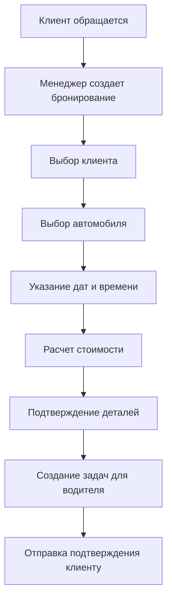
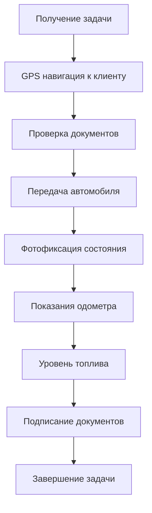
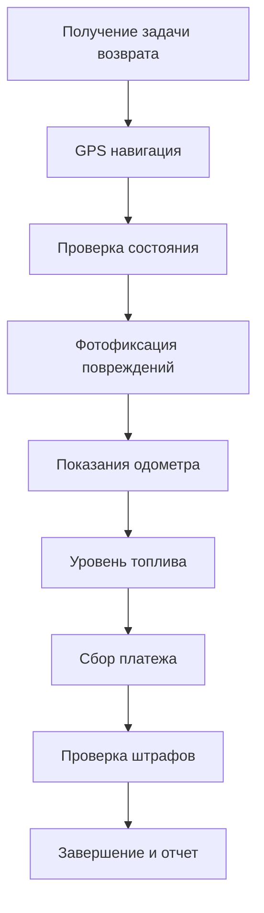
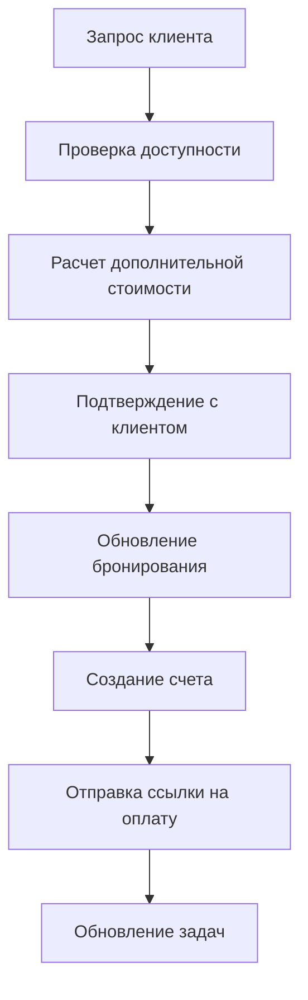

# Комплексный анализ системы SkyLuxse

## Оглавление
1. [Обзор системы](#обзор-системы)
2. [Целевая аудитория и пользовательские роли](#целевая-аудитория-и-пользовательские-роли)
3. [Ключевые функции и модули](#ключевые-функции-и-модули)
4. [Архитектура системы](#архитектура-системы)
5. [Сущности данных](#сущности-данных)
6. [Пользовательские потоки](#пользовательские-потоки)
7. [Бизнес-процессы](#бизнес-процессы)
8. [Технологический стек](#технологический-стек)
9. [Интеграции](#интеграции)
10. [Рекомендации для PRD](#рекомендации-для-prd)

---

## Обзор системы

**SkyLuxse** — это комплексная система управления арендой автомобилей класса люкс, предназначенная для автоматизации бизнес-процессов компании по прокату премиальных транспортных средств в Дубае. Система представляет собой современное веб-приложение с модульной архитектурой, поддерживающее множественные пользовательские роли и обеспечивающее полный цикл управления арендой от первичного обращения клиента до возврата автомобиля.

### Ключевые характеристики
- **Тип**: Single Page Application (SPA)
- **Архитектура**: Клиент-ориентированная с модульной структурой
- **Масштаб**: Премиальный сегмент аренды автомобилей
- **Локация**: Дубай, ОАЭ
- **Технологии**: Современный JavaScript стек с ES6 модулями

---

## Целевая аудитория и пользовательские роли

### Первичные пользователи

#### 1. **Операционный менеджер (Operations)**
- **Ответственность**: Общий контроль операционных процессов
- **Функции**: Управление бронированиями, мониторинг статусов, координация между отделами
- **Доступ**: Полный доступ ко всем модулям системы

#### 2. **Менеджер автопарка (Fleet Manager)**
- **Ответственность**: Управление автомобильным парком
- **Функции**: Контроль статусов автомобилей, планирование обслуживания, мониторинг документооборота
- **Доступ**: Автопарк, календарь, отчеты по транспорту

#### 3. **Менеджер по продажам (Sales)**
- **Ответственность**: Работа с клиентами и продажи
- **Функции**: Управление воронкой продаж, работа с лидами, аналитика продаж
- **Доступ**: Клиенты, аналитика, воронка продаж

#### 4. **Водитель (Driver)**
- **Ответственность**: Выполнение операционных задач
- **Функции**: GPS трекинг, выполнение доставки/возврата, сбор платежей, документирование состояния
- **Доступ**: Ограниченный доступ к задачам и данным клиентов

#### 5. **Руководитель (CEO)**
- **Ответственность**: Стратегическое управление
- **Функции**: Аналитика, отчеты, оценка качества обслуживания
- **Доступ**: Дашборды, аналитика, отчеты

### Вторичные пользователи
- **Клиенты**: Получают доступ через специальные ссылки для оплаты
- **Партнеры**: Интеграция через API (планируется)
- **Техническая поддержка**: Административный доступ для решения технических вопросов

---

## Ключевые функции и модули

### 1. **Управление автопарком**
- **Реестр автомобилей**: Полная информация о каждом ТС (марка, модель, год, номер, статус)
- **Мониторинг статусов**: Доступен / В аренде / На обслуживании
- **Управление документами**: Страховка, регистрация, технический осмотр
- **Календарь автопарка**: Визуализация занятости и планирование обслуживания

### 2. **Система бронирований**
- **Создание бронирований**: Форма с полной информацией о клиенте, автомобиле, сроках
- **Kanban доска**: Визуальное управление статусами бронирований
- **Расширение аренды**: Система продления с автоматическим расчетом стоимости
- **Отслеживание истории**: Полная история изменений каждого бронирования

### 3. **Управление клиентами**
- **Профили клиентов**: Персональная информация, статус (VIP/Gold/Silver)
- **Документооборот**: Хранение и проверка документов клиентов
- **Финансовая история**: Оборачиваемость, задолженности, пожизненная ценность
- **Поиск и фильтрация**: Быстрый поиск по различным параметрам

### 4. **Система задач**
- **Типы задач**: Доставка, возврат, подготовка, обслуживание
- **Назначение ответственных**: Привязка к водителям
- **SLA контроль**: Отслеживание сроков выполнения
- **Чек-листы**: Обязательные процедуры для каждого типа задач

### 5. **Работа с водителями**
- **GPS трекинг**: Отслеживание местоположения в реальном времени
- **Задачи водителя**: Специализированный интерфейс для выполнения операций
- **Сбор платежей**: Возможность получения наличных с обоснованием
- **Документирование состояния**: Фотофиксация, показания одометра

### 6. **Аналитика и отчеты**
- **Финансовая аналитика**: Выручка, расходы, прибыльность
- **Производительность автопарка**: Анализ использования автомобилей
- **Воронка продаж**: Конверсия лидов в продажи
- **Оценка качества**: Система рейтингов обслуживания

### 7. **Календарная система**
- **Временная шкала**: Отображение событий по дням/неделям
- **Конфликтное планирование**: Предотвращение пересечений
- **События**: Бронирования, обслуживание, ремонт
- **Интеграция с задачами**: Автоматическое создание задач

---

## Архитектура системы

### Структура проекта
```
beta/
├── assets/                 # Статические ресурсы
│   ├── css/               # Стили (Tailwind CSS)
│   ├── js/
│   │   ├── components/    # UI компоненты
│   │   ├── core/          # Основная логика
│   │   ├── utils/         # Вспомогательные функции
│   │   └── templates/     # HTML шаблоны
│   └── images/            # Изображения
├── data/                  # Конфигурация и мок-данные
│   ├── config/            # Настройки ролей и прав
│   └── mock/              # Имитационные данные
├── src/                   # Исходный код приложения
│   ├── data/              # Управление данными
│   ├── render/            # Рендеринг компонентов
│   ├── state/             # Управление состоянием
│   └── ui/                # UI элементы
├── docs/                  # Документация
├── public/                # Публичные ресурсы
└── scripts/               # Скрипты сборки
```

### Архитектурные принципы

#### 1. **Модульная архитектура**
- **Разделение ответственности**: Каждый модуль отвечает за свою область
- **Переиспользование**: Общие компоненты вынесены в отдельные модули
- **Масштабируемость**: Легкое добавление новых функций

#### 2. **Управление состоянием**
- **Централизованное состояние**: `appState.js` содержит все глобальное состояние
- **Обработка оффлайн режима**: Синхронизация данных при восстановлении соединения
- **Фильтрация и поиск**: Сохранение пользовательских фильтров

#### 3. **Роутинг**
- **Hash-based routing**: Использование URL хэшей для навигации
- **Динамическая загрузка**: Страницы загружаются по требованию
- **Сохранение состояния**: Поддержка истории браузера

#### 4. **Обработка ошибок**
- **Глобальный обработчик**: Перехват всех JavaScript ошибок
- **Graceful degradation**: Корректная работа при сбоях компонентов
- **Логирование**: Подробное логирование для отладки

---

## Сущности данных

### 1. **Автомобили (Cars)**
```javascript
{
  id: "number",
  name: "string",           // Название модели
  plate: "string",          // Госномер
  year: "number",           // Год выпуска
  class: "string",          // Класс (люкс/спорт/внедорожник)
  segment: "string",        // Сегмент
  color: "string",          // Цвет
  status: "string",         // Доступен/В аренде/Обслуживание
  imagePath: "string",      // Путь к изображению
  mileage: "number",        // Пробег
  documents: [              // Документы
    {
      type: "string",       // insurance/mulkiya
      expiry: "date"
    }
  ]
}
```

### 2. **Клиенты (Clients)**
```javascript
{
  id: "number",
  name: "string",           // Полное имя
  email: "string",          // Email адрес
  phone: "string",          // Телефон
  company: "string",        // Компания (опционально)
  status: "string",         // VIP/Gold/Silver
  lifetimeValue: "number",  // Пожизненная ценность
  outstanding: "number",    // Задолженность
  documents: [              // Документы клиента
    {
      id: "string",
      name: "string",
      status: "string"      // verified/needs-review
    }
  ]
}
```

### 3. **Бронирования (Bookings)**
```javascript
{
  id: "number",
  code: "string",           // Код бронирования
  clientId: "number",       // Ссылка на клиента
  carId: "number",          // Ссылка на автомобиль
  driverId: "number",       // Ссылка на водителя
  startDate: "date",        // Дата начала
  endDate: "date",          // Дата окончания
  startTime: "time",        // Время начала
  endTime: "time",          // Время окончания
  status: "string",         // Статус бронирования
  totalAmount: "number",    // Общая сумма
  paidAmount: "number",     // Оплаченная сумма
  pickupLocation: "string", // Место получения
  dropoffLocation: "string",// Место возврата
  extensions: [             // Расширения аренды
    {
      id: "string",
      startDate: "date",
      endDate: "date",
      status: "string",
      pricing: { total: "number" }
    }
  ],
  history: [                // История изменений
    {
      ts: "datetime",
      event: "string"
    }
  ]
}
```

### 4. **Задачи (Tasks)**
```javascript
{
  id: "number",
  title: "string",          // Название задачи
  type: "string",           // Тип (delivery/pickup/maintenance)
  category: "string",       // Категория
  assigneeId: "number",     // Исполнитель
  status: "string",         // Статус (todo/inprogress/done)
  deadline: "datetime",     // Срок выполнения
  bookingId: "number",      // Связанное бронирование
  priority: "string",       // Приоритет
  checklist: [              // Чек-лист
    {
      id: "string",
      label: "string",
      required: "boolean",
      completed: "boolean"
    }
  ]
}
```

### 5. **Водители (Drivers)**
```javascript
{
  id: "number",
  name: "string",           // Имя водителя
  phone: "string",          // Телефон
  status: "string",         // Статус (Available/On Task)
  location: {               // GPS координаты
    lat: "number",
    lng: "number"
  }
}
```

---

## Пользовательские потоки

### 1. **Создание нового бронирования (Sales)**


### 2. **Выполнение доставки автомобиля (Driver)**


### 3. **Возврат автомобиля (Driver)**


### 4. **Расширение аренды (Operations)**


---

## Бизнес-процессы

### 1. **Управление жизненным циклом автомобиля**
- **Регистрация**: Добавление нового ТС в систему
- **Статусы**: Доступен → В аренде → Возвращен → Обслуживание → Доступен
- **Обслуживание**: Плановое ТО, ремонт, подготовка к аренде
- **Документооборот**: Контроль сроков действия документов

### 2. **Управление клиентскими отношениями**
- **Сегментация**: VIP → Gold → Silver → Regular
- **Оценка кредитоспособности**: На основе истории и статуса
- **Управление задолженностями**: Отслеживание и взыскание
- **Программа лояльности**: Персонализированный сервис

### 3. **Операционные процессы**
- **Планирование ресурсов**: Автомобили, водители, время
- **Контроль качества**: Проверка состояния ТС, документирование
- **Координация**: Синхронизация между отделами
- **Реакция на инциденты**: Быстрое решение проблем

### 4. **Финансовые процессы**
- **Ценообразование**: Динамическое ценообразование по сезонам/событиям
- **Биллинг**: Автоматическое выставление счетов
- **Оплата**: Интеграция с платежными системами
- **Отчетность**: Финансовая аналитика и прогнозирование

---

## Технологический стек

### Frontend
- **Язык программирования**: JavaScript (ES6+)
- **Архитектура**: Single Page Application (SPA)
- **Модули**: ES6 Modules для организации кода
- **Стили**: Tailwind CSS для UI
- **Иконки**: SVG иконки для интерфейса
- **Изображения**: Оптимизированные изображения автомобилей

### Архитектурные решения
- **Состояние**: Централизованное управление состоянием
- **Роутинг**: Hash-based навигация
- **Кэширование**: Service Worker для оффлайн режима
- **Сборка**: Модульная система сборки
- **Развертывание**: Vercel платформа

### Структура данных
- **Формат данных**: JSON
- **Мок-данные**: Имитация реальных данных для демонстрации
- **Валидация**: Клиентская валидация форм
- **Фильтрация**: Динамическая фильтрация и поиск

---

## Интеграции

### Существующие интеграции

#### 1. **Google Maps**
- **Навигация**: Интеграция с Google Maps для навигации водителей
- **Маршруты**: Расчет оптимальных маршрутов
- **Геокодирование**: Преобразование адресов в координаты

#### 2. **Stripe (запланировано)**
- **Платежные ссылки**: Создание ссылок для онлайн оплаты
- **Обработка платежей**: Автоматическое списание средств
- **Возвраты**: Управление возвратами и частичными платежами

#### 3. **Система документооборота**
- **Хранение документов**: Локальное хранение изображений документов
- **Проверка статусов**: Отслеживание статусов проверки документов
- **Срок действия**: Автоматические уведомления об истечении

### Потенциальные интеграции

#### 1. **CRM системы**
- **Интеграция с Salesforce**: Синхронизация данных клиентов
- **Управление лидами**: Автоматический импорт лидов

#### 2. **ERP системы**
- **Финансовый учет**: Интеграция с системами бухгалтерского учета
- **Управление складом**: Учет запчастей и расходных материалов

#### 3. **Телекоммуникации**
- **SMS уведомления**: Автоматические SMS клиентам
- **Email маркетинг**: Рассылки и email кампании

#### 4. **IoT устройства**
- **GPS трекеры**: Продвинутое отслеживание автомобилей
- **Датчики топлива**: Автоматический контроль уровня топлива
- **Видеорегистраторы**: Системы безопасности и контроля

---

## Рекомендации для PRD

### 1. **Приоритизация функций**

#### Высокий приоритет
- **Стабильность системы**: Устранение технических долгов
- **Производительность**: Оптимизация загрузки и отклика
- **Безопасность**: Улучшение аутентификации и авторизации
- **Мобильная версия**: Адаптация для мобильных устройств

#### Средний приоритет
- **Интеграция с платежными системами**: Завершение Stripe интеграции
- **Расширенная аналитика**: Более детальные отчеты и прогнозирование
- **Автоматизация процессов**: Сокращение ручного труда
- **API для партнеров**: Внешние интеграции

#### Низкий приоритет
- **Мультиязычность**: Поддержка арабского языка
- **White-label решение**: Возможность перепродажи решения
- **Мобильные приложения**: Нативные iOS/Android приложения

### 2. **Технические улучшения**

#### Архитектура
- **Микросервисная архитектура**: Разделение на независимые сервисы
- **API Gateway**: Централизованное управление API
- **Database sharding**: Горизонтальное масштабирование данных
- **Event-driven архитектура**: Асинхронная обработка событий

#### Производительность
- **CDN**: Распределенная доставка контента
- **Кэширование**: Многоуровневое кэширование данных
- **Lazy loading**: Отложенная загрузка компонентов
- **Bundle optimization**: Оптимизация размера JavaScript бандлов

#### Безопасность
- **JWT токены**: Современная аутентификация
- **OAuth 2.0**: Интеграция с социальными сетями
- **Шифрование данных**: End-to-end шифрование чувствительных данных
- **Audit логи**: Полное логирование действий пользователей

### 3. **Пользовательский опыт**

#### Интерфейс
- **Responsive design**: Адаптация под все устройства
- **Dark mode**: Темная тема для комфортной работы
- **Персонализация**: Настройка интерфейса под пользователя
- **Accessibility**: Соответствие стандартам доступности

#### Функциональность
- **Автозаполнение**: Умное автозаполнение форм
- **Bulk операции**: Массовые операции над данными
- **Экспорт данных**: Выгрузка в различные форматы
- **Интерактивные дашборды**: Настраиваемые аналитические панели

### 4. **Бизнес-процессы**

#### Автоматизация
- **Workflow engine**: Автоматизация бизнес-процессов
- **Rule engine**: Бизнес-правила для автоматических решений
- **Notification system**: Централизованная система уведомлений
- **Escalation management**: Автоматическая эскалация проблем

#### Аналитика
- **Real-time дашборды**: Живые обновления данных
- **Predictive analytics**: Прогнозирование спроса
- **Customer analytics**: Глубокий анализ поведения клиентов
- **Operational metrics**: KPI для операционной эффективности

### 5. **Техническая дорожная карта**

#### Фаза 1 (Краткосрочная - 3 месяца)
1. **Стабилизация текущей системы**
   - Устранение критических багов
   - Оптимизация производительности
   - Улучшение системы безопасности

2. **Завершение основных интеграций**
   - Полная интеграция Stripe
   - Улучшение Google Maps интеграции
   - Базовая мобильная адаптация

#### Фаза 2 (Среднесрочная - 6 месяцев)
1. **Расширение функциональности**
   - Продвинутая аналитика
   - Система отчетности
   - API для внешних интеграций

2. **Техническая модернизация**
   - Переход на современный фреймворк (React/Vue)
   - Микросервисная архитектура
   - Облачная инфраструктура

#### Фаза 3 (Долгосрочная - 12+ месяцев)
1. **Масштабирование**
   - Multi-tenant архитектура
   - Международная экспансия
   - White-label решение

2. **Инновации**
   - ИИ и машинное обучение
   - IoT интеграция
   - Автономные системы управления

### 6. **Метрики успеха**

#### Технические метрики
- **Uptime**: 99.9% доступность системы
- **Response time**: < 2 секунды для всех операций
- **Error rate**: < 0.1% ошибок в продакшене
- **Security incidents**: 0 критических инцидентов

#### Бизнес метрики
- **User adoption**: Увеличение активных пользователей на 50%
- **Process automation**: Сокращение ручных операций на 70%
- **Customer satisfaction**: Увеличение NPS на 30%
- **Revenue impact**: Увеличение выручки на 25% за счет эффективности

---

## Заключение

Система SkyLuxse представляет собой комплексное решение для управления премиальным сервисом аренды автомобилей. Архитектура системы демонстрирует современный подход к разработке веб-приложений с использованием модульной структуры и передовых технологий.

### Ключевые преимущества
- **Комплексность**: Покрывает все аспекты бизнеса аренды автомобилей
- **Масштабируемость**: Модульная архитектура позволяет легко расширять функциональность
- **Пользовательский опыт**: Интуитивный интерфейс для всех типов пользователей
- **Операционная эффективность**: Автоматизация ключевых бизнес-процессов

### Области для улучшения
- **Производительность**: Оптимизация для работы с большими объемами данных
- **Мобильность**: Разработка нативных мобильных приложений
- **Интеграции**: Расширение списка внешних интеграций
- **Безопасность**: Усиление мер защиты данных

Система готова к масштабированию и может служить основой для развития бизнеса в области премиальной аренды автомобилей.

---

*Анализ подготовлен: 05.11.2025*  
*Версия документа: 1.0*  
*Автор: Системный архитектор*